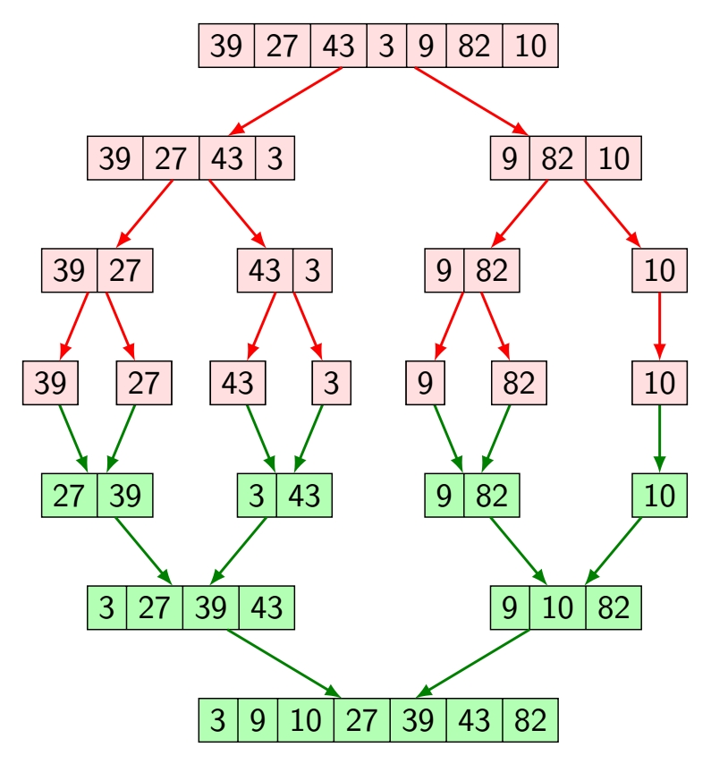
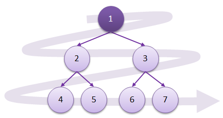
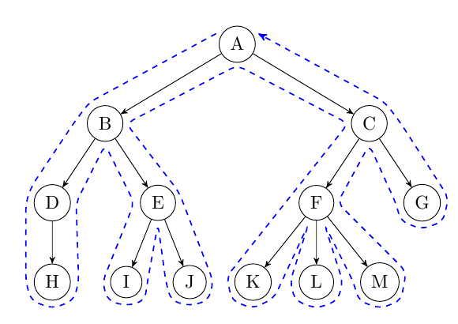
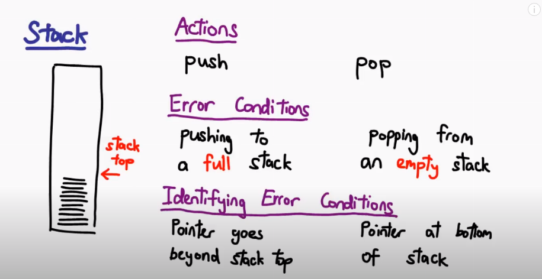
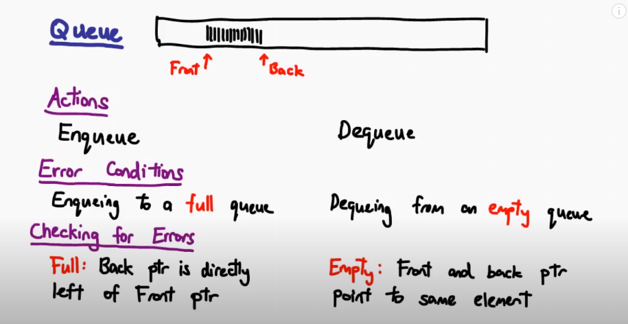
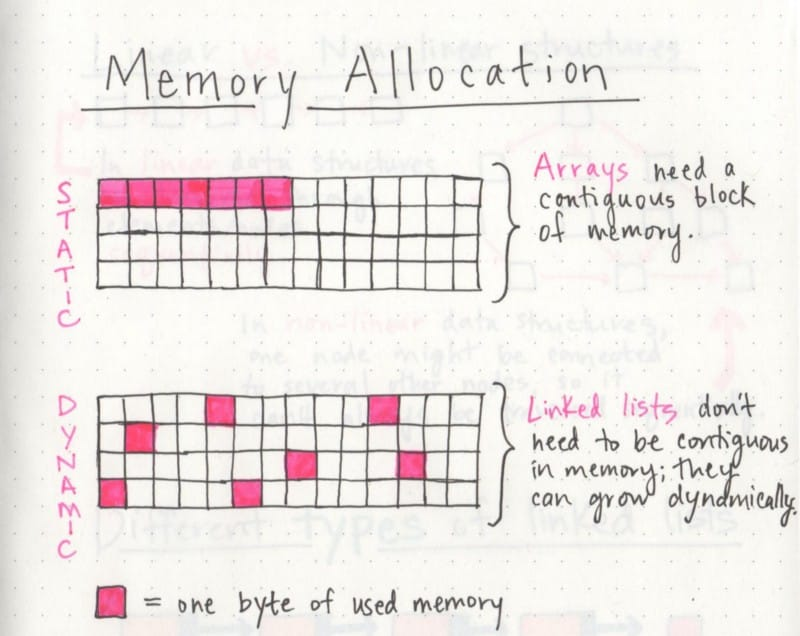
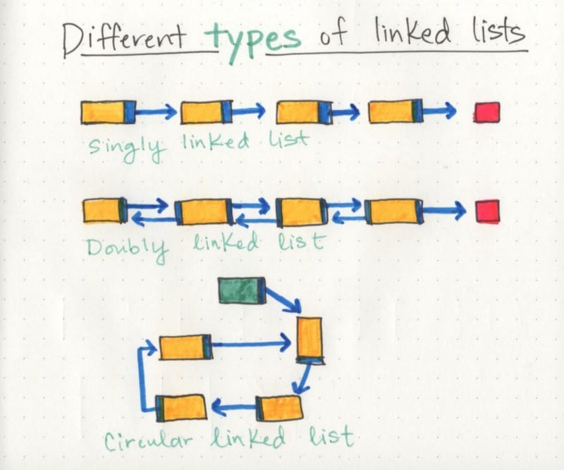
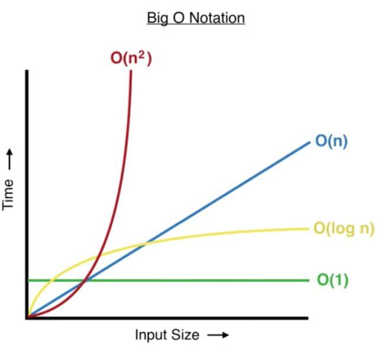
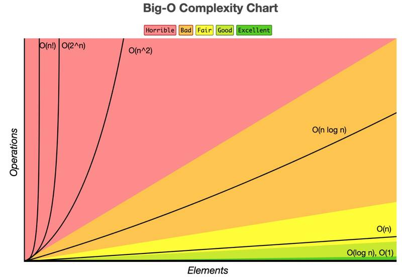

# Algorithm Cheatsheet

1. Merge Sort

## Merge Sort

Worst-case: `O (n log n)`

1. Split a list into ~2 halves
2. Continue dividing subarrays until left with single element arrays `[2]` `[5]`
3. Merge subarrays in a sorted order, starting with single element arrays
4. Merge the rest of the subarrays by their 1st index



```js
const merge = (left, right) => {
  let arr = [];

  // while both left/right have elements left, add them
  // in sorted order to `arr`
  while (left.length && right.length) {
    left[0] < right[0]
      ? arr.push(left.shift()) // shift: return 1st element & rm it from orig. array
      : arr.push(right.shift());
  }
  // return sorted array & any leftover elements
  // at this point, any leftover elements are already sorted & larger than the last element in 'arr'
  return [...arr, ...left, ...right];
};

const mergeSort = (array) => {
  // base case: single element arrays
  if (array.length < 2) return array;

  // find middle element
  const mid = array.length / 2;

  // remove left side of array
  // leaving right side in 'array' variable
  const left = array.splice(0, mid);

  // magic:
  return merge(mergeSort(left), mergeSort(array));
};
```

## Binary Search

Binary Search is a divide & conquer algorithm for searching an array.

- Requires a **sorted** array
- Reduces search area by half each time

Best case: `O 1`
Worst case: `log n`

Instructions:

- Repeat until subarray is size 0 (base case)
  - When start point > end point
- Calculate mid point of current array
- If search target = midpoint, stop
- If target < midpoint, repeat, changing end point to be just left of middle
- If target > midpoint, repeat, start point to be just right of the middle

Information needed:

- Target
- Start point
- End point
- Mid point

## Binary Search Tree


Binary Search Tree Ground Rules:

1. Parent nodes have, **at most**, 2 child nodes.
2. Left child node is **always** less than parent node.
3. Right child is **always** greater than or equal to parent node.

Creating a binary search tree from an array:

`[10, 7, 14, 20, 1, 5, 8]`

1. Set root node: `10`
2. All remaining values will be **children of the root node**
   - If less than root node, the next number goes to left
   - If equal to OR greater than root node, the next number goes to right

## Binary Tree Traversal

Binary tree traversal is:

- Process of visiting each node in the tree
- Exactly once
- In some order

> Visiting: Reading & processing data in a node

Binary tree's are not a linear data structure.

From each node, there are 2 possible directions you can travel.

Tree traversal can be classified by two categories: breadth-first (level-order) and depth-first.

### **Breadth-first** (Level-order)



              A
            /   \
          D       J
         / \     / \
        B   E   G   K
       / \       \
      A   C       I
                 /
                H

- Visit all nodes at the current level
- Queue: A, D, J, B, E, G, K, A, C, I, H

Time complexity: `O(n)`
Space complexity:

- Best: `O(1)`
- Worst: `O(n)`
- Avg: `O(n)`

Algorithm pseudo-code:

```js
// data structure
node = {
  data
  leftChild
  rightChild
}

function levelOrder(rootNode) {
  if (rootNode === null) return;
    queueArr.push(rootNode);
    while (queue is not empty) {
      currentNode = queueArr[queueArr.length-1];
      console.log(currentNode);
      if (currentNode.leftChild !== null) queueArr.push(currentNode.leftChild);
      if (currentNode.rightChild !== null) queueArr.push(currentNode.rightChild);
      queueArr.pop(); // remove last element
    }

}

```

### **Depth-first** (One Side)



- Visit all children of a given path
- Stack: A, D, B, A, C, E, J, G, I, H, K
- Preorder:
  - Root, Left, Right
  - Data, L, R
- Inorder
  - Left, Root, Right
  - L, Data, R
- Postorder:
  - Left, Right, Root
  - L, R, Data

Time Complexity: `O(n)`
Space Complexity: `O(h)` height of tree

- Worst: `O(n)`
- Best: `O(log n)`
- Avg: `O(log n)`

```js
Node = {
  data,
  leftNode,
  rightNode,
};

// preorder: D, L, R
function preorder(rootNode) {
  if (rootNode === null) return;

  console.log(rootNode.data);
  preorder(rootNode.leftNode);
  preorder(rootNode.rightNode);
}

// inorder: L, D, R
function inorder(rootNode) {
  if (rootNode === null) return;

  inorder(rootNode.left);
  console.log(rootNode.data);
  inorder(rootNode.rightNode);
}

// postorder: L, R, D
function postorder(rootNode) {
  if (rootNode === null) return;

  postorder(rootNode.leftNode);
  postorder(rootNode.rightNode);
  console.log(rootNode.data);
}
```

### Is Binary Tree a Binary SEARCH Tree

A binary search tree requires that all left nodes are less than the root node and all right nodes are greater than the root node.

Algorithm:

```js
node = {
  data,
  nodeLeft,
  nodeRight,
};

function isBinarySearchTree(rootNode) {
  // base case
  if (rootNode === null) return;

  if (
    isSubtreeLesser(rootNode.leftNode, rootNode.data) &&
    isSubtreeGreater(rootNode.rightNode, rootNode.data) &&
    isBinarySearchTree(rootNode.leftNode) &&
    isBinarySearchtree(rootNode.rightNode)
  )
    return true;
  return false;
}

function isSubtreeLesser(rootNode, value) {
  // base case
  if (root === NULL) return true;

  if (
    rootNode.data <= value &&
    isSubtreeLesser(rootNode.leftNode, value) &&
    isSubtreeLesser(rootNode.rightNode, value)
  )
    return true;
  return false;
}

function isSubtreeGreater(rootNode, value) {
  // base case
  if (root === NULL) return true;

  if (
    rootNode.data > value &&
    isSubtreeGreater(rootNode.leftNode, value) &&
    isSubtreeGreater(rootNode.rightNode, value)
  ) {
    return true;
  }
  return false;
}
```

## Stacks

**Stack**: Can only add/remove from top of stack

- Elements are sorted by **insertion order**
- Last element in is first out (**LIFO**)
- Elements have no index
- Can only add/remove from the top

_Stack of books_

- Add book to the top of the pile
- Remove book from the top of the pile

Real life examples:

- Undo button
- Back/Forward in web browser



Stacks have two functions:

- `Push`: Add to top of stack
  - Look for pointer
  - Push item there
  - Move pointer up +1
- `Pop`: Remove top most item
  - Move pointer down -1
  - Remove element

Error Conditions:

- Pushing to a full stack
  - If pointer is at `n` (array size) or greater
  - Disable push
- Popping from an empty stack
  - If pointer points to element 0 (stack is empty)
  - Disable pop

Stacks require:

- Array
- Variable pointing to top of stack

## Queues

Queues are good for managing resources, such as a print queue or web site access.

- The person who's been waiting the longest goes first

**Queues**: Front & back

- Elements are sorted by **insertion order**
- First element in is first out (**FIFO**)
- Elements have no index
- Can only add to back (enqueue) & remove from the front (dequeue)



Queues have two functions:

- **Enqueue**: Add to back (_offer_)
- **Dequeue**: Remove from front (_poll_)

Queues are good for managing resources, such as a print queue or web site access.

- The person who's been waiting the longest goes first

Basic Logic:

- 2 Pointers: Front & Back
  - Back pointer: points to next empty slot
  - Front pointer: points to a number
- Dequeue:
  - Remove item @ front pointer location
  - Move front pointer +1
- Enqueue
  - Add item to back pointer location
  - Move pointer +1
- Loop to beginning of array if end of array it reached
  - Use Modulo: for array of size 5
  - Position 4, use `(pointer + 1) % 5` => `5 % 5` becomes [0]

Error Conditions:

- Enqueue to a full queue
  - To see if a queue is full, check if the back pointer is directly to the left of the front pointer
  - Full: back=3, front=4
- Dequeueing from an empty queue
  - To see if a queue is empty, check if front pointer & back pointer are the same value
  - Empty: back=0, front=0

## Linked Lists

Linked Lists are one of the most basic & fundamental data structures.

- Similar to array
- List elements can be easily inserted & removed **without reallocating other elements**
- Allows us to dynamically allocate data

Structure of a linked list:

- Linear collection of data elements called **nodes**
- **Nodes** point to the next node by means of a **pointer**
- Each node holds:
  - single element of data
  - link/pointer to the next node in the list

> A node only knows about what data it contains and who its neighbor is.

**Head node**: first node in the list

- Not a separate node
- Reference to first node

**Tail node**: last node in the list

```js
[ NODE(head) ] -> [ NODE ] -> [ NODE(tail) ] -> null
```

**Linear Data Structures**: there is a **sequence** and **an order** to how they are constructed and traversed.

- Game of hopscotch
  - In order to reach the end of the list, we need to go through all of the items in the list in order, or _sequentially_
- Arrays

**Non-linear Data Structures**: items don't need to be arranged in order. We can traverse the data structure _non-sequentially_.

- Hashes (ie: dictionaries)

## **Arrays Vs. Linked Lists**

Main difference is how they _use memory._

Dynamically typed languages (JS, Python, Ruby) don't require us to think about how much memory an array uses in our code

- Layers of abstraction allow us to not worry about it
- Abstraction: Hides away the real benefit of linked list and their power



**Arrays**

- require one contiguous block of memory
- static data structure: require& all resources to be allocated when it's created
- if it needs to be expanded, we need to copy the data or that array & recreate it with more memory in order to add more elements to it

**Linked Lists**

- don't need to be contiguous in memory and can grow dynamically
- dynamic data structure
- can grow and shrink with minimal effort: change a few pointer references

## Types of Linked Lists



**Singly Linked Lists**: only go in one direction

- Single track we can traverse in
- Head node to the last node (null value)

**Doubly Linked Lists**: can go in both directions

- Two references within each node
- Next node & previous node

**Circular Linked Lists**: doesn't end with a node pointing to a null value.

- Has a node that acts as the _tail_ of the list (rather than a head node)
- Node after the tail is the beginning of the list
- Easy to add something to end of list
- Can begin traversing it at the tail node
  - Because first & last element point to one another

## Time Complexity

Other than making code readable and maintainable, efficiency & performance are very important.

We can measure the efficiency of our code in two ways:

- Time complexity
- Space complexity

### Efficiency Basics

```js
function oddNumbersLessThanTen() {
  let currentNumber = 1;

  while (currentNumber < 10) {
    if (currentNumber % 2 !== 0) {
      console.log(currentNumber);
    }

    currentNumber += 1;
  }
}
```

- `1, 3, 5, 7, 9`
- Ran in the terminal, this should take a fraction of a second
- Ran again, it might take the same time, faster or slower

Important: **Never measure efficiency** of an algorithm by **how long it takes to execute**

To measure code efficiency, we evaluate how many steps it takes to complete.

- If one algorithm takes 5 steps & another takes 20 steps to accomplish the same task:
  - 5 Step algorithm will always run faster than the 20 step algorithm

In the above algorithm:

1. Assign number 1 to var (**1 step**)
2. Loop: for each iteration...
   1. Compare currentNumber < 10 (**1 step**)
   2. Check if odd (**1 step**)
      1. If odd, we output to terminal (**1 step every 2 iterations**)
   3. Increase currentNumber by 1 (**1 step**)

There are **3 steps** for every loop iteration and it iterates 9 times which is 27 steps. Then we have one step which iterates only half the loop iteration, which is 5 steps.

Assigning initial value is 1 step.

Total: 33 steps (27 + 5 + 1)

Our algorithm takes 33 steps to complete.

**While useful to know, this isn't actually helpful for comparing algorithms.**

```js
// Accepts an input instead of a hard value of 10
function oddNumbers(maxNumber) {
  let currentNumber = 1;

  while (currentNumber < maxNumber) {
    if (currentNumber % 2 !== 0) {
      console.log(currentNumber);
    }

    currentNumber += 1;
  }
}
```

How many steps does this take? _It depends_. It can't be measured concretely.

What we need to measure is **how the number of steps our algorithm changes when the data changes.**

To do that, we use **Asymptotic Notations** & in particular, **Big O**

### Asymptotic Notations

Aysmptotic Notations describe the **running time** of an algorithm.

Running time can vary based on the input. The 3 most common ways to measure running time:

- **Big O Notation**: worst case - upper bound of an algorithm
- **Omega Notation**: best case - lower bound of an algorithm
- **Theta Notation**: average case - upper & lower bound of an algorithm

Big O is the most commonly referenced because _you need to be sure the worst-case scenario is scalable._

The differences in how the 3 asymptotic notations **measure efficiency**

### What is Big O?

Big O = consistent way to measure efficiency of an algorithm.

- Measurement of **time it takes to run** as input grows
- Used to directly compare performance of 2 algorithms
- Pick best one

To use big one, you need to measure how the # of steps changes as the data grows. You can then apply a Big O Notation to it and measure it against other algorithms.

### Big O Notation

From **FASTEST** to **SLOWEST**:

| Big O      | Complexy               |
| ---------- | ---------------------- |
| O(1)       | constant complexity    |
| O(log N)   | logarithmic complexity |
| O(N)       | linear complexity      |
| O(N log N) | N x log N complexity   |
| O(n^2)     | quadratic complexity   |
| O(n^3)     | cubic complexity       |
| O(2^n)     | exponential complexity |
| O(N!)      | factorial complexity   |

### O(1) Constant Complexity

`arr = [1,2,3,4,5]`

To look up index 2, we use `arr[2]` = 1 step.

`arr = [1,2,3,4,5,6,7,8,9,10]` (if the array doubles)

We can access any element in 1 step.

Complexity is **constant**.

**Gotcha**: Technically not 1 step. Computer must first loop up where the array is in memory. From the 1st element it must jump to the index provided. _it's at least a couple of steps._

However, the 2 steps are merely incidental. With an array of 10,000 elements, **it still takes the same amount of steps.**

Big O doesn't concern itself with incidental numbers.

- Big O = tells us an algorithm's complexity **relative to the size of the input**

### O(log N) Logarithmic Complexity

Logarithmic: as data DOUBLES, steps increase by 1.

Going from 5000 to 10000 data elements = 1 additional step.

Example: **Binary Search.**

`arr = [1,2,3,4,5,6,7,8,9,10]`

Binary Search for 7:

- Guess middle item: 6
- Anything to left cannot be 7

`arr = [-, -, -, -, -, 6, 7, 8, 9, 10]`

- 1 Step: Eliminated half of the array

| Size | Steps |
| ---- | ----- |
| 1    | 1     |
| 2    | 2     |
| 4    | 3     |
| 8    | 4     |
| 16   | 5     |
| 32   | 6     |

Very efficient.

### O(N) Linear Complexity

Linear Complexity: number of inputs & steps grow at same rate

Example: Iterating over an array

`arr = [1, 2, 3, 4, 5]` = 5 inputs, 5 steps
`arr = [1, 2, 3, 4, 5, 6, 7,]` = 7 inputs, 7 steps

### O(N Log N) - N x Log N Complexity

Initial Algorithm: O(log N)

- Binary Search: repeatedly breaks array in half

O(N Log N):

- Repeatedly break array in half
- Each half is processed by another algorithm with a complexity of O(N).

Example: **Merge sort**

### O(n^2) - Quadratic Complexity

Quadratic complexity: Loop over dataset & within each loop, you loop over it again.

- Input +1, 2 extra iterations are required.
- Input +2, 4 extra iterations are required.
- Input +3, 9 extra iterations are required.
- Input +4, 16 extra iterations are required.

### O(n^3) - Cubic Complexity

Cubic complexity: Nested loops - 1 extra item = 3 extra steps

- Input +1, 3 extra iterations are required.
- Input +2, 8 extra iterations are required.
- Input +3, 27 extra iterations are required.
- Input +100, ~1,000,000 extra iterations are required.

### O(2n) - Exponential Complexity

Exponential complexity: each item added, number of steps doubles from the previous number of steps.

**Avoid this if at all possible!**

| Size | Steps |
| ---- | ----- |
| 1    | 2     |
| 2    | 4     |
| 3    | 8     |
| 4    | 16    |
| 5    | 32    |
| 6    | 64    |

### O(N!) - Factorial Complexity

Factorial complexity: product of the sequence of _n_ integers.

- Factorial of 4(4!): 4 x 3 x 2 x 1

Factorial complexity = need to calculate permutations or combinations.

- _If you have an array and have to work out all of the combinations you can make from the array_.
- Manageable for small inputs, but the leap from each item in a dataset can be huge.
- Factorial of 3: 6 (3 x 2 x 1)
- Factorial of 4: 24 (4 x 3 x 2 x 1)
- Factorial of 10: 3,628,800

### Big Ω (Omega Notation) - alternative to Big O

Omega notation: best case scenario for our algorithm.

```js
function findValue(arr) {
  for (let i = 0; i < arr.length; i++) {
    let item = arr[i];
    if (item === 1) {
      return item;
    }
  }
}
```

Big O (worst case): O(N) - linear complexity. If the value isn't in our array, we must iterate over every single value.

Big Omega (best case): (1) - constant complexity. If value is in the first index

- Not as useful as Big O: it's unlikely our item will be the 1st item in our data structure

### Big-Θ (Big-Theta Notation) - alternative to Big O

Theta notation: looks to give us the exact value or a useful range between narrow upper and lower bounds.

Iterating over an array: always run at O(1) constant complexity.

- Best & Worst case: O(1)
- Theta performance: O(1) - exact performance

### Why Big O?

Big O = worst case scenario. It makes sure our algorithm will scale in all outcomes.

### Algorithms with the same complexity

If two algorithms are written with the same complexity, does that mean they're equally good to use?

```js
// algo 1
function oddNumbers(maxNumber) {
  let currentNumber = 1;

  while (currentNumber < maxNumber) {
    if (currentNumber % 2 !== 0) {
      console.log(currentNumber);
    }

    // increases # by 1
    currentNumber += 1;
  }
}

// algo 2
function oddNumbers(maxNumber) {
  let currentNumber = 1;

  while (currentNumber < maxNumber) {
    if (currentNumber % 2 !== 0) {
      console.log(currentNumber);
    }

    // increases # by 2
    currentNumber += 2;
  }
}
```

Not much of a change between the two. For an input of `n`, the number of steps is roughly **half** as we iterate by 2 each time.

Big O doesn't care about **constants**. Comparing O(N/2 + 5N) to O(N + 5 / 2N) wouldn't be fun.

**Both algorithms are O(N).**

### Examples

[Doable Danny](https://www.doabledanny.com/big-o-notation-in-javascript)

Time Complexity: how runtime of an algorithm changes as input increases

Space Complexity: space required by algorithm, not including inputs

> Constant time complexity

```js
// O(1) constant complexity: always same amount of time
function timesTwo(num) {
  return 2 * num;
}

// O(1) constant complexity: NOT O(2)
// - Input does not change the # of steps taken
function manyTimes(num) {
  let total = 4 * num;
  return total * 3;
}
```

> Linear time complexity

```js
// O(N) linear complexity: NOT O(2n)
// - 3 elements: 6 operations
// - 6 elements: 12 operations
// - 12 elements: 24 operations
function reverseArray(arr) {
  let newArr = [];
  for (let i = arr.length - 1; i >= 0; i--) {
    newArr.push(arr[i]);
  }
  return newArr;
}
const reversedArray1 = reverseArray([1, 2, 3]); // [3, 2, 1]
const reversedArray2 = reverseArray([1, 2, 3, 4, 5, 6]); // [6, 5, 4, 3, 2, 1]
```



> Quadratic time complexity

```js
// O (n^2) quadratic complexity
// - nested loop
function multiplyAll(arr1, arr2) {
  if (arr1.length !== arr2.length) return undefined;
  let total = 0;
  for (let i of arr1) {
    for (let j of arr2) {
      total += i * j;
    }
  }
  return total;
}
let result1 = multiplyAll([1, 2], [5, 6]); // 33
let result2 = multiplyAll([1, 2, 3, 4], [5, 3, 1, 8]); // 170
```

> Built-in Array Methods:

```js
// O(1) - constant time - end of array
arr.push(5);
arr.pop();

// O(n) - linear time complexity - front of array
// - reindexes the rest of the array
arr.unshift(0);
arr.shift();
```

> Logarithmic time complexity:

Logarithmic: "qty representing the **power** to which a fixed number (base) must be raised to produce a given number"

Log 2(16) = x

- 2 is the base (bottom of log)
- What power do we need to raise by to get 16?
- x = 4 (2 x 2 x 2 x 2)

In computer science, the base of log(20) is assumed to be **2** or Binary Logarithm (not 10).

```js
// O(log N) - Logarithmic time complexity
function logTime(arr) {
  let numberOfLoops = 0;
  for (let i = 1; i < arr.length; i *= 2) {
    numberOfLoops++;
  }
  return numberOfLoops;
}

let loopsA = logTime([1]); // 0 loops
let loopsB = logTime([1, 2]); // 1 loop
let loopsC = logTime([1, 2, 3, 4]); // 2 loops
let loopsD = logTime([1, 2, 3, 4, 5, 6, 7, 8]); // 3 loops
let loopsE = logTime(Array(16)); // 4 loops
```



> Linearithmic time complexity O(n log n)

```js
// O(n log n) - Linearithmic time complexity
function linearithmic(n) {
  // linear complexity
  for (let i = 0; i < n; i++) {
    // log n complexity
    for (let j = 1; j < n; j = j * 2) {
      console.log("Hello");
    }
  }
}
```

> Exponential time complexity

```js
// O(n^2) - exponential time complexity
function fibonacci(num) {
  // Base cases
  if (num === 0) return 0;
  else if (num === 1) return 1;
  // Recursive part
  return fibonacci(num - 1) + fibonacci(num - 2);
}
```

> Factorial time complexity

Traveling salesman problem: Given a list of cities & distances between each pair, what is the shortest route taken to visit each city exactly once & return to the origin city?

3 Cities: A, B, C (1 x 2 x 3 = 6 permutations)

- A -> B -> C
- A -> C -> B
- B -> A -> C
- B -> C -> A
- C -> A -> B
- C -> B -> A

```js
// O(n!)
// 5 = 1 * 2 * 3 * 4 * 5 = 120
// Recursive factorial algorithm

function factorial(n) {
  let num = n;
  if (n === 0) return 1;
  for (let i = 0; i < n; i++) {
    num = n * factorial(n - 1);
  }
  return num;
}

factorial(1); // 0.02 ms
factorial(2); // 0.04 ms
factorial(10); // 42.08 ms
factorial(12); // 5231.54 ms => 5 seconds
factorial(13); // 69565.01 ms => 70 SECONDS!
factorial(14); // SMOKE & FLAMES!!
```

## Comparing Complexity

Steps:

- Break functions into individual steps
- Calc each step
- Add each step together

Rules:

- Always assume worst scenario (Big O)
- Inputs = unique variable
- Drop constants
- Drop non-dominant terms

> Linear O(n) example

```js
const productList = [
  { name: "Laptop", price: 18487 },
  { name: "Keyboard", price: 356 },
  { name: "Monitor", price: 8345 },
  // ...assuming 10000 more items here in between
  { name: "Tablet", price: 9875 },
];

function lookupPrice(name, list) {
  for (let i = 0; i < list.length; i++) {
    if (list[i].name === name) {
      console.log(`Price of '${list[i].name}' is: ${list[i].price}`);
      break;
    }
  }
}

lookupPrice("Monitor", productList);
// => OUTPUT: "Price of 'Monitor' is: 8345"
```

### Multiple inputs must have a unique name

```js
// function receives 2 different inputs, let's call them 'a' and 'b'
function printLists(listOne, listTwo) {
  // iterates through input 'listOne' -> O(a) Linear time
  for (let i = 0; i < listOne.length; i++) {
    console.log(listOne[i]);
  }
  // iterates through input 'listTwo' -> O(b) Linear time
  for (let i = 0; i < listTwo.length; i++) {
    console.log(listTwo[i]);
  }
}
```

**Result**: O(a + b)

Why is this not O(n)?

- Two different inputs
- Loops 1st list: O(n)
- Loops 2nd list: O(n)

**2nd List has to wait until the 1st is done**

- Loop #1: 0(a)
- Loop #2: O(b)
- Result: O(a+b) => takes both linear times to finish execution

> Nested Loop w/ 2 different inputs

```js
const drinks = ["water", "coffee"];
const persons = ["person 1", "person 2", "person 3", "person 4"];

// function recieves 2 different inputs, let's call them 'a' and 'b'
function servingDrinks(drinkList, personsList) {
  // iterates through input 'drinkList' -> O(a) Linear time
  for (let i = 0; i < drinkList.length; i++) {
    // iterates through input 'personsList' -> O(b) Linear time
    for (let j = 0; j < personsList.length; j++) {
      console.log(`Gives ${drinkList[i]} to ${personsList[j]}`);
    }
  }
}

servingDrinks(drinks, persons);

// End result for Big O => O (a * b)

/*
OUTPUT:
'Gives water to person 1'
'Gives water to person 2'
'Gives water to person 3'
'Gives water to person 4'
'Gives coffee to person 1'
'Gives coffee to person 2'
'Gives coffee to person 3'
'Gives coffee to person 4'
*/
```

- 1st input: O(a)
- 2nd input: O(b)
- Result: O(a \* b) due to nesting

NOT O(a^2) because two different inputs are being looped over

### Reminders

**Multiple inputs:**

- Loop **2 separate arrays**, one after another => O(a+b)
  - Any step after another => +
- Loop **2 nested arrays** => O(a\*b)
  - Nested steps => \*

**Single inputs:**

- Loop **same array one after another** => O(n+n) => O(2n) => O(n) linear time
- Loop **same array with 2 nested loops** => O(n^2) quadratic time

### **Drop the constants**

- **Constants**: Don't change, regardless of how big input size is
- **Constants**: DON'T AFFECT SCALING

```js
const numbers = [1, 2, 3, 4, 5, 6];

// function receives a single input
function printFirstHalf(list) {
  // iterates through list -> O(n) Linear time
  for (let i = 0; i < list.length / 2; i++) {
    console.log(list[i]);
  }
}

printFirstHalf(numbers);
// Big O total => O (n / 2)

/* 
OUTPUT:
1
2
3
*/
```

**Result**: O(n) Linear time

- Only iterates over half of the array: O(n/2)
- Execution time is **dependent on input length**
- Drop the constant: `/2`
  - O(n/2) becomes O(n)

```js
const numbers = [1, 2, 3];

// function recieves a single input
function printTwiceForNoReason(list) {
  // iterates through list -> O(n) Linear time
  for (let i = 0; i < list.length; i++) {
    console.log(list[i]);
  }
  // iterates through the same list again -> O(n) Linear time
  for (let j = 0; j < list.length; j++) {
    console.log(list[j]);
  }
}

printTwiceForNoReason(numbers);

// Big O total => O (n + n) => O (2n)

/*
OUTPUT:
1
2
3
1
2
3
*/
```

Result: O(n) linear time

- Same input, loop after loop: O(n + 2) => O(2n)
- Drop constants: O(n)

### Calculating Big O

When adding up steps:

- Define constants: **numbers**
- Define scalable(s): **letters**
- End up with lots of letters & numbers
- **^ Will be removed to only focus on scaling pattern**

### Drop non-dominant terms

Always assume the worst case.

- Compare all steps (complexities)
- Pick worst scaling one (dominant term)
  - ^ Last rule to finish Big O calculations (finalize analysis of an algorithm)

```js
const fruits = ["apple", "strawberry", "watermelon"];

// function recieves a single input
function printAndPair(arr) {
  // iterates through list -> O(n) Linear time
  for (let i = 0; i < arr.length; i++) {
    console.log(arr[i]);
  }

  // declares variable -> O(1) Constant time
  const totalPairs = arr.length * arr.length;
  // prints given value -> O(1) Constant time
  console.log("Estimated paired elements length:", totalPairs);

  // nested loop using the same array -> O(n ^ 2) Quadratic time
  for (let j = 0; j < arr.length; j++) {
    for (let k = 0; k < arr.length; k++) {
      console.log(`${arr[j]} - ${arr[k]}`);
    }
  }
}

printAndPair(fruits);

// Big O total => O (n) + O(1) + O(1) + O(n ^ 2)

/*
OUTPUT:
'apple'
'strawberry'
'watermelon'

'Estimated paired elements length:' 9

'apple - apple'
'apple - strawberry'
'apple - watermelon'
'strawberry - apple'
'strawberry - strawberry'
'strawberry - watermelon'
'watermelon - apple'
'watermelon - strawberry'
'watermelon - watermelon'
*/
```

Function has **4 operations** w/ various time complexities:

Result: O(n) + O(1) + O(1) + O(n^2)

1. Add all constants:
   1. O(n) + O(2) + O(n^2)
2. Remove all constants:
   1. O(n) + O(n^2)
3. Which one scales worst? (of non-constant time complexities)
   1. O(n^2)

Result: **O(n^2)**

## Space Complexity

Space Complexity: Total space used by algorithm, relative to input size

- Want to know: how efficiency changes when input changes

Measuring space complexity:

- **Input**
- **Auxillary space**: extra space used by algorithm

Auxillary space:

- Temporary variables
- **MEMORY** needed by our algorithm

### Importance of Space Complexity

- Space complexity is **not very important** vs time complexity
  - Memory = Cheap vs Processing power
  - Most algorithms deal w/ smaller input sizes
  - Rarely run into slow apps due to low memory

However, memory = fixed amount.

- Can't expand memory on the fly
- Time complexity: you can allow program to run for longer w/o issue
- _Space complexity: can't do this_

### Measuring Space Complexity

Measuring space complexity = measuring time complexity:

- O(1) - Constant Complexity
- O(log N) - Logarithmic Complexity
- O(N) - Linear Complexity
- O(N log N) - N x log N Complexity
- O(n²) - Quadratic Complexity
- O(n³) - Cubic Complexity
- O(2ⁿ) - Exponential Complexity
- O(N!) - Factorial Complexity

#### O(1) - Constant Complexity

```js
function multiply(num1, num2) {
  return num1 * num2; // 2 variables are created, always
}
```

#### O(N) - Linear Complexity

O(N) = Most common space complexity

```js
function sumArr(arr) {
  const copyArr = arr.slice();
  let sum = 0;
  copyArr.forEach((number) => {
    sum += number;
  });
  return sum;
}
```

Two variables:

- `sum`
- `copyArr`

Amount of space used: depends on array passed to it.

- Could be 3 or 300 elements

When we don't know length of array: `N`

- N + 1 (sum var) => drop constants
- O(N)

> As object size increases, space grows in linear way

```js
function sumObjectValues(obj) {
  const copyObject = { ...obj };
  let sum = 0;
  Object.values(copyObject).forEach((value) => {
    sum += value;
  });
  return sum;
}
```

- [Big O Cheatsheet](https://www.bigocheatsheet.com/)

### Considerations

In JS, arrays & objects passed as an argument to a function are passed **by reference**.

- Should they be counted towards the space complexity of an algorithm? (input size)?
