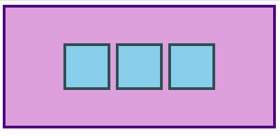

# CSS

**CSS** is a Stylesheet language that changes how HTML documents are styled. It affects font styles, colors, layout and responsive features.

## Basic Syntax

- CSS is made up of rules
  - Selector
  - Semi-colon
  - List of declarations
    - Property:Value pair

```css
/* selector */
div.bold-text {
  font-weight: 700;
  /* property: value; */
}
```

## Selector

- Refer to HTML elements to which the CSS rules apply
  - What's being selected for each rule

### Universal Selector

```css
/* styles.css */
* {
  color: purple;
}
```

### Type Selector

- Selects elements of the given **element type**

```html
<!-- index.html -->
<div>Please agree to our terms of service.</div>
```

```css
/* styles.css */
div {
  color: white;
}
```

### Class Selector

- Selects elements with the given **class**
- Classes are **attributes** you place on an HTML element

```html
<!-- index.html -->
<div class="alert-text">
  Welcome to the machine.
</div
```

```css
/* styles.css */
.alert-text {
  color: red;
}
```

### ID Selector

- Similar to class selectors
- Select elements with a given ID
- Use a hashtag followed by case sensitive ID
- **Common pitfall**: overusing ID. Classes will suffice most of the time and ID's should be use **sparingly (if at all)**
- Used when specificity is needed or having links redirect to a section on the current page
- Elements can have only **ONE ID** & **NO WHITESPACE**

```html
<!-- index.html -->
<div id="title">Welcome to the machine.</div
```

```css
/* styles.css */
#title {
  background-color: white;
}
```

### Grouping Selectors

- Used with multiple groups of elements that share style declarations

```css
.read,
.unread {
  color: white;
  background-color: black;
}

.read {
  /* several unique declarations */
}

.unread {
  /* several unique declarations */
}
```

### Chaining Selectors

- Used to apply styles to a specific combo of selectors
- Must contain all selectors in order for rules to apply
- No space between selectors
- Can't chain multiple `type` selectors (ie: div, p, h1)
  - Because that would give you `divph1`

```html
<div>
  <div class="subsection header">Latest Posts</div>
  <p class="subsection preview">This is where a preview for a post might go.</p>
</div>
```

```css
/* elements that contain both classes */
.subsection.header {
  color: red;
}
/* can mix classes and id's*/
.subsection#preview {
  color: blue;
}
```

### Descendant Combinator

- Allow you to combine multiple selectors by their relationship between them
- There are [**4** types of combinators](https://developer.mozilla.org/en-US/docs/Web/CSS/Reference#combinators) in total
- Represented by single space between selectors
- Matches the **last selector only**
  - If they also have an ancestor (parent, grandparent, etc.) that matches the previous selector
- `.ancestor .child` would select the class `child` if it has the ancestor with the class `ancestor`
  - If it is **nested** inside of ancestor

```html
<!-- index.html -->
<div class="ancestor">
  <!-- A -->
  <div class="contents">
    <!-- B -->
    <div class="contents"><!-- C --></div>
  </div>
</div>

<div class="contents"></div>
<!-- D -->
```

In this example, **BOTH B & C** would be selected.

```css
/* styles.css */
.ancestor .contents {
  /* some declarations */
}
```

# Properties

## Color Values

- **Common keywords** (Predefined, Cross-browser)
  - ie: `red`, `coral`, `transparent`
  - [Full List of Pre-defined Colors](https://www.w3schools.com/colors/colors_names.asp)

```css
#p1 {
  background-color: red;
} /* red */
#p2 {
  background-color: transparent;
} /* transparent */
```

- **HEX values**
  - ie: `#ff0000` (red)
  - Specified with `#RRGGBB`
    - `RR`: Red values
    - `GG`: Green values
    - `BB`: Blue values
  - Range: `00` (lowest) to `FF` (highest)

```css
#p1 {
  background-color: #ff0000;
} /* red */
#p2 {
  background-color: #00ff00;
} /* green */
#p3 {
  background-color: #0000ff;
} /* blue */
```

- **HEX values with transparency**
  - ie: `#ff000080`
  - Transparency: Add 2 digitals between `00` & `FF`

```css
#p1a {
  background-color: #ff000080;
} /* red transparency */
#p2a {
  background-color: #00ff0080;
} /* green transparency */
#p3a {
  background-color: #0000ff80;
} /* blue transparency */
```

- **RGB values**
  - ie: `rgb(red, green, blue)`
  - `rgb()` is a _function_
  - Intensity of each value: 0 (lowest) to 255 (highest)

```css
#p1 {
  background-color: rgb(255, 0, 0);
} /* red */
#p2 {
  background-color: rgb(0, 255, 0);
} /* green */
#p3 {
  background-color: rgb(0, 0, 255);
} /* blue */
```

- **RGBA values**
  - ie: `rgba(red, green, blue, alpha)`
  - RGB colors with an **_alpha channel_**
    - Specifies opacity of the object
    - Alpha: 0.0 (fully transparent) to 1.0 (opaque)

```css
#p1 {
  background-color: rgba(255, 0, 0, 0.3);
} /* red with opacity */
#p2 {
  background-color: rgba(0, 255, 0, 0.3);
} /* green with opacity */
#p3 {
  background-color: rgba(0, 0, 255, 0.3);
} /* blue with opacity */
```

- **HSL values**
  - ie: `hsl(hue, saturation, lightness)`
  - Cylindrical-coordinate representation of colors
  - `hsl()` is a function
  - **Hue**: Color Wheel `0` - `360`
    - Red: `0` or `360`
    - Green: `120`
    - Blue: `240`
  - **Saturation**: Percentage value
    - Shade of gray: `0%`
    - Full color: `100%`
  - **Lightness**: Percentage value
    - Black: `0%`
    - White: `100%`

```css
#p1 {
  background-color: hsl(120, 100%, 50%);
} /* green */
#p2 {
  background-color: hsl(120, 100%, 75%);
} /* light green */
#p3 {
  background-color: hsl(120, 100%, 25%);
} /* dark green */
#p4 {
  background-color: hsl(120, 60%, 70%);
} /* pastel green */
```

- **HSLA values**
  - ie: `hsla(hue, saturation, lightness, alpha)`
  - Alpha parameter: `0.0` - `1.0`
    - Fully transparent: `0.0`
    - Fully Opaque: `1.0`

```css
#p1 {
  background-color: hsla(120, 100%, 50%, 0.3);
} /* green with opacity */
#p2 {
  background-color: hsla(120, 100%, 75%, 0.3);
} /* light green with opacity */
#p3 {
  background-color: hsla(120, 100%, 25%, 0.3);
} /* dark green with opacity */
#p4 {
  background-color: hsla(120, 60%, 70%, 0.3);
} /* pastel green with opacity */
```

### Color & Background Color

- **Color** property: text color
- **Background-Color** property: background color of an element

```css
p {
  /* hex example: */
  color: #1100ff;
  /* rgb example: */
  color: rgb(100, 0, 127);
  /* hsl example: */
  color: hsl(15, 82%, 56%);
}
```

## Typography Basics & Text Align

### Font Family

- `font-family` can be single value, or comma-separated list for fonts
- Falls into 1 of 2 categories:
  - Font Family Name: `Times New Roman`
  - Generic Family Name:
    - `sans-serif` have clean lines, modern, minimal
      - ie: Arial, Verdana, Helvetica
    - `serif` are formal, elegant, have small stroke at edge of each char
      - ie: Times New Roman, Georgia, Garamond
    - `monospace` have fixed width, mechanical look
      - ie: Courier New, Lucida Console, Monaco
    - `cursive` imitate human handwriting
      - ie: Brush Script MT, Lucida Handwriting
    - `fantasy` are decorative, playful
      - ie: Copperplate, Papyrus
- If browser can't find 1st font in list, it will use the next one
- **Best Practice:** Include list of values, starting with top preference, and ending with least preferred

```css
font-family: "Times New Roman", sans-serif;
font-family: "Times New Roman", Times, serif;
font-family: Arial, Helvetica, sans-serif;
font-family: "Lucida Console", "Courier New", monospace;
```

### Custom Font Family

- `@font-face` is used for loading custom fonts in browser & present it to site
- Must appear **before other styling properties**
- Requires 2 properties:
  - `font-family` font name
  - `src` URL to download the font

```css
@font-face {
  font-family: fontname;
  src: url(https://fonts.gstatic.com/s/lato/v16/S6u_w4BMUTPHjxsI5wq_Gwftx9897g.woff2);
  font-weight: italic;
}
```

- Alternative: **Linking fonts** in the `<head>`

```html
<head>
  <link
    href="https://fonts.googleapis.com/css?family=Gayathri&display=swap"
    rel="stylesheet"
  />
</head>
```

- Alternative: **Importing fonts** using `@import` to css

```css
@import url("https://fonts.googleapis.com/css?family=Gayathri&display=swap");
```

- [Google Fonts API](https://developers.google.com/fonts/docs/getting_started)

```html
<link rel="stylesheet" href="https://fonts.googleapis.com/css?family=Inter" />
```

### Font Size

- `font-size` should contain NO whitespace

```css
font-size: 22px;
```

### Font Weight

- `font-weight` affects boldness of text
- Values can be:
  - the word `bold` or a value between `1` - `1000`
  - **Typically** in increments of `100` up to `900`, depending on the font: `200`, `300`, `400`
  - `bold` word equivalent: `700`

```css
font-weight: 700;
```

### Text Align

- `text-align` aligns text horizontally within an element
- Common keywords:
  - `center`, `right`, `left`

```css
text-align: center;
```

### Image Height & Width

- Default `` size = actual image's `height` & `width`
- `auto` value will automatically adjust size of an image without causing it to lose its proportions

```css
img {
  height: auto;
  width: 500px;
}
```

- If the above image had a height of `500px` and width of `1000px`
- `auto` would downsize the `height` to `250px`
- **Best Practices**
  - **ALWAYS** include _both_ height & width for _ALL_ images
  - Reserves space on the page & will appear blank until image loads
  - If `height` & `width` are not included & the image takes longer to load than the rest of the page, the **image will not take up any space on page at first**
  - Will suddenly cause a drastic shift of the other page contents once loaded

## [The Cascade of CSS](https://wattenberger.com/blog/css-cascade)

- Sometimes rules conflict with one another
- CSS does what we tell it to do
- Unexpected behavior can occur due to:
  - _Default styles_ vary from browser to browser
    - ie: Large gaps between elements, button styles, etc. can appear on it's "own"
  - Not understanding `the cascade` or how a `property` works
- **The CSS Cascade is the way our browsers resolve competing CSS declarations.**
  1. **Importance**
     1. **_transition_** - active transitions are #1
     2. `!important` - reserve for overriding 3rd party libraries
     3. **_animation_** - active animation
     4. **_normal_** - bulk of rules
  2. **Origin**, where rules are defined
     1. **_website_**: in your control as web developer
     2. **_user_**
     3. **_browser_**: each browser has its own set of default styles
  3. **[Specificity](#specificity)**
  4. **Position**, rule order

## Specificity

- If two or more CSS rules that point to the same element, the selector with the **highest specificity** value will "win", and its style declaration will be applied to that HTML element.
  - Creates a score or ranking system
- **More specific** CSS declarations > **less specific** CSS declarations
- Specificity only matters when elements have _multiple, conflicting declarations_ (a tie breaker):
- Hierarchy
  1. **Inline** `<h1 style="color: white">`
  2. **Layers** unlayered > layered `@layers one, two;`
  3. **ID** selectors `#navbar`
  4. **Class** `.class`, **Attribute Selectors** `[href]` or `[checked]`, **Pseudo Selectors** `:hover` or `:first-of-type`
  5. **Type** or **Pseudo-eEement** selectors `h1` or `:before`

```html
<div class="main">
  <div class="list subsection"></div>
</div>
```

> **Multiple** classes > **Single** class

```css
/* rule 1 */
.subsection {
  color: blue;
}

/* rule 2 -- MORE SPECIFIC */
.main .list {
  color: red;
}
```

---

```html
<div class="main">
  <div class="list" id="subsection"></div>
</div>
```

> **ID** selector > **Multiple Class** selectors

```css
/* rule 1 -- MORE SPECIFIC */
#subsection {
  color: blue;
}

/* rule 2 */
.main .list {
  color: red;
}
```

> **1 ID** & **2 Class** Selectors > **1 ID** & **1 Class** Selector

```css
/* rule 1 */
#subsection .list {
  background-color: yellow;
  color: blue;
}

/* rule 2 -- MORE SPECIFIC */
#subsection .main .list {
  color: red;
}
```

**Chaining Selector** (_no space_) & **Descendant Combinator** (_empty space_) **DO NOT AFFECT specificity**

```css
/* rule 1 -- SPECIFICITY EQUAL TO rule 2 */
.class.second-class {
  font-size: 12px;
}

/* rule 2 -- SPECIFICITY EQUAL TO rule 1 */
.class .second-class {
  font-size: 24px;
}
```

**Universal selector** `*` and **Combinators** `+`, `~`, `>`, ` ` (_empty space_) **DO NOT ADD specificity**

```css
/* rule 1 -- NO SPECIFICITY */
* {
  color: black;
}

/* rule 2 -- MORE SPECIFIC (Type selector) */
h1 {
  color: orange;
}
```

## Inheritance

- CSS Properties, when applied to an element, are inherited by the element's **descendants**
  - Even if we don't explicitly write a rule for it
- **Typography** based properties **ARE USUALLY** inherited
- Most **OTHER** properties **AREN'T** inherited

**Exception**: Directly targeting an element > inheritance

```html
<!-- index.html -->
<div id="parent">
  <div class="child"></div>
</div>
/* styles.css */
```

```css
/* Inherited */
#parent {
  color: red;
}

/* Directly targeted -- TAKES PRECEDENCE */
.child {
  color: blue;
}
```

## Rule Order

- Final factor in a tie-breaker
- If multiple conflicting rules target an element
  - The _last_ defined rule is the winner

```html
<div class="alert warning"></div>
```

```css
.alert {
  color: red;
}

/* defined last, takes precedence */
.warning {
  color: yellow;
}
```

## Adding CSS to HTML

### External CSS

- Most common method
- Create a separate file for CSS
- Link to inside HTML's `<head>` tag with the `<link>` element
  - ie: `<link rel="stylesheet" href="styles.css">`
  - `href` is the location of the CSS file
  - `rel` specifics relationship between HTML & linked file
- Pros of external css:
  - HTML & CSS are separate, smaller HTML, cleaner look
  - Edit CSS in only 1 place, _handy for multiple pages that share similar styles_

```html
<!-- index.html -->
<head>
  <link rel="stylesheet" href="styles.css" />
</head>
```

```css
/* styles.css */

/* declaration block */
div {
  /* selector */
  /* declarations */
  color: white;
  /* color: property */
  /* white: value */
  background-color: black;
}

/* declaration block */
p {
  /* selector */
  /* declarations */
  color: red;
  /* color: property */
  /* white: value */
}
```

## Internal CSS (Embedded)

- Add CSS within HTML doc itself
- Place all rules inside `<style>` tags, within the `<head>` of the HTML file
  - No longer require `<link>` tag
- Useful for adding _unique styles_ to a _single page_
- Causes HTML files to be larger

```html
<head>
  <style>
    div {
      color: white;
      background-color: black;
    }

    p {
      color: red;
    }
  </style>
</head>
<body>
  ...
</body>
```

## Inline CSS

- Add CSS tags directly to HTML elements
- Added with the `style=` attribute
- Used when you need a `unique` style for a `single` element
- **NOT recommended**:
  - Gets messy quickly, bloated
  - If you want to share styles among elements, it requires a lot of _copy_ and _pasting_
  - Inline CSS **_overrides_** all other methods, causing unexpected results

## Inspecting HTML & CSS

- Inspecting & Debugging HTML/CSS is criticial to frontend development
- **Chrome Dev Tools** is used to see detailed info & assists in finding/fixing problems in code

### The Inspector

- To access the inspector in Google Chrome
  - `Right Click` on element & click `Inspect Element`
  - `CTRL+SHIFT+C` to Inspect Elements on hover
  - `F12`
  - `CTRL+SHIFT+I` to open the last panel you had open
  - `Arrow Keys` to go up/down and expand elements in DOM
  - `Right Click` on element within DOM and `Scroll into view` to hop to it's location on the page
  - `H` hides currently selected node
  - `Delete` deletes currently selected node
- HTML: Initial page contents
- DOM: current page contents

#### Inspecting Elements (the DOM)

- Blue top left arrow icon: inspect any element on hover
- Elements: HTML
- Styles: CSS Rules
  - ~~Strikethrough~~ - overwritten style

#### Testing Styles

- [Styles pane allows you to directly edit in your browser](https://developer.chrome.com/docs/devtools/css)
  - Add new rules
  - Edit existing rules
- Changes apply in real-time
- Does NOT affect source code
- **Extremely useful** for testing out various attributes & values without having to reload page over and over

#### [Overview of Chrome DevTools](https://developer.chrome.com/docs/devtools/overview/)

- `CTRL+F` Find things in DevTools

##### Device Mode

- Simulate mobile devices

##### Elements panel

- View & change DOM & CSS

##### Console

- View messages & run JavaScript from the Console
- `CTRL+SHIFT+J`

##### Sources Panel

- Debug JavaScript
- Persist changes made in DevTools across page reloads
- Save & run snippets of JavaScript
- Save changes you make in DevTools to disk

##### Network Panel

- View & debug network activity

##### Performance Panel

- Find ways to improve load & runtime performance

##### Memory Panel

- Fix memory problems
- JavaScript CPU Profiler

##### Application Panel

- Inspect all resources that are loaded
  - IndexedDB or Web SQL databases
  - Local & Session Storage
  - Cookies
  - Application Cache
  - Images
  - Fonts
  - Stylesheets

##### Security Panel

- Debug
  - Mixed content issues
  - Certificate problems, etc.

#### [CSS Overview](https://www.freecodecamp.org/news/how-to-use-css-overview-in-chrome-developer-tools/)

- `CTRL+SHIFT+I`, click 3 dot icons > `More tools` > `CSS Overview`
- Click `Capture Overview`
- Menu Options
  - Overview Summary
    - Number of Elements used
    - Selector types
    - Number of inline style elements
    - Number of external stylesheets
  - Colors
    - Each color is clickable
    - Shows which elements use each color
  - Font Info
    - `font-size`, `line-height`, `font-weight`, `font-family`
    - Where they're used
  - Unused declarations
    - Styles that don't affect the web page
  - Media Queries
    - Various widths & screen resolutions used in creating the page
    - ie: `screen` and `(max width:736px)`

## The Box Model

- Most important CSS skills: **positioning** & **layout**
- JavaScript is meaningless if you can't stick elements on the page where you need them
- Every single thing on page is a **rectangular box**
- Boxes can have other boxes in them and can sit next to one another

```css
/* To test the box model: */
* {
  border: 2px solid red;
}
```

> Parts of a box
>
> 

- Manipulating boxes & space between them:
  - `border`, space between margin & padding
  - `padding`, space between edge of box & content
    - inside the border
    - includes `background-color`
  - `margin`, space between box & any other boxes next to it
    - **collapse** between two elements
    - highest `margin` value wins
    - outside of the border
    - not affected by `background-color`
  - `height`, `width` size of inner element
- ["True" height of an element](https://www.youtube.com/watch?v=rIO5326FgPE), add all values:
  - `padding` top & bottom
  - `border` top & bottom
  - `height`
- `box-sizing: border-box;`
  - Almost always added to CSS
  - Makes stylizing easier
  - Added to universal selector (`* { }`)
  - Ensures `height` and `width` are obeyed

> Standard CSS Box Model
>
> 

> Border-Box in CSS


### Box Types

In CSS, there are two types of boxes. The type refers to how the box behaves in terms of _page flow_ and _in relation_ to other boxes.

- **Block**
  - `display: block`
  - Appear stacked atop each other
  - Each new element creates a new line
  - Fills available _inline_ space of the parent element and _grows_ along the _block_ dimension to accommodate its content
  - **Centering** a block: `margin: auto`
- **Inline**
  - Sizes according to its content
  - Sits inside _content_ of _block-level elements_
  - Do not start a new line
  - Appear _in line_ with with elements they are placed beside
  - ie: `<a>`
  - Generally, don't add extra padding/margin on inline elements
  - **Inline-block** elements
    - Behave like inline elements
    - Have block-style padding & margin
    - Useful, but `flexbox` is better for lining up boxes

Boxes then have an **inner** and **outer** display type.

#### Outer Display Type

- `block` outer display types:

  - Break onto a **new line**
  - Width & Height are respected
  - Other elements will be **pushed away** using padding, margin, border
  - Box extends in _inline_ direction to fill space available in container
    - Become as wide as it's container, 100% of the space
  - ie: `<h1>` and `<p>` use `block` by default

- `inline` outer display types:
  - Will NOT break onto a **new line**
  - Width & Height are NOT applied
  - **Vertical** padding, margins, border WILL apply
    - WON'T push other inline boxes away from the box
  - **Horizontal** padding, margins, borders WILL apply
    - WILL push other inline boxes away from the box
  - ie: `<a>`, `<span>`, `<em>`, `<strong>`

#### Inner Display Type

Inner display types dictate how elements **inside that box** are laid out.

- Default: Elements _inside_ a box are laid out in:
  - **normal flow**
  - Behave as `block` or `inline`
- Change inner display type with `display: flex;`
  - Still uses _outer_ display type `block`
  - _Inner_ display type `flex`

### DIV's & Spans

- DON'T give meaning to their content
- Generic boxes that can do anything
- Used to _hook_ elements
  - Give `id` or `class` to them for CSS styling
  - Grouping related elements under one parent element to _correctly position them_ on the page

#### DIV

- Block-level element by default
- Used as a container to group other elements
- Divs allow us to _divide_ pages into blocks and apply styles to those blocks

#### Span

- Inline-level element by default
- Group text content and inline HTML elements for styling
- Should only be used when no other _semantic_ HTML element is appropriate

### Normal Flow

- Default layout of elements in the Box Model
- Block-level elements
  - `<address><article><aside><blockquote><canvas><dd><div><dl><dt><fieldset><figcaption><figure><footer><form><h1>-<h6><header><hr><li><main><nav><noscript><ol><p><pre><section><table><tfoot><ul><video>`
- Inline-level elements
  - `<a><abbr><acronym><b><bdo><big><br><button><cite><code><dfn><em><i><input><kbd><label><map><object><output><q><samp><script><select><small><span><strong><sub><sup><textarea><time><tt><var>`

## [Flex Box](https://developer.mozilla.org/en-US/docs/Web/CSS/CSS_Flexible_Box_Layout/Basic_Concepts_of_Flexbox)

- Flexbox is a way to arrange items into _rows_ and _columns_
- Based on simple rules you can define
- Fill available area w/ _equal width_

```html
<div class="flex-container">
  <div class="one"></div>
  <div class="two"></div>
  <div class="three"></div>
</div>
```

```css
.flex-container {
  display: flex;
  /*
  flex-direction: row
  > start from edge of main axis
  > does not grow on main dimension, but can shrink
  >
  /*
}

/* this selector selects all divs inside of .flex-container */
.flex-container div {
  background: peachpuff;
  border: 4px solid brown;
  height: 100px;
  flex: 1;
}
```

#### Flex Containers & Flex Items

- Flexbox is a **toolbox** of properties to put things where you need them
- Any element can be a **BOTH** a flex **container** & flex **item**
- **Flex Containers**: `display:flex`
- **Flex items**: `flex: 1`
- Creating/nesting multiple flex containers and items is the primary way we will be building up complex layouts

```html

```

```css
/* flex containers */
.container {
  display: flex;
  display: inline-flexinline;
}
```


#### Flex Shorthand

- `flex` declaration: **shorthand** for **3 properties**
  - shorthand: CSS properties that allow you to set values of multiple **other** properties simultaneously
- `flex: flex-grow, flex-shrink, flex-basis;`
- `flex: 0, 1, 0%;`

##### Flex-Grow

- `flex: flex-grow, *, *`
- Single number
- Flex-item's **Growth Factor**
  - `flex: 1;` To all DIV's = grow the same amount
  - `flex: 2;` To 1 DIV = 2x the size as `flex: 1;`

##### Flex-Shrink

- Similar to `flex-grow`
- Flex-item's **Shrink Factor**
- **Only applied** if size of ALL flex items is **larger** than their parent
- Default: `flex-shrink: 1;`
  - ie: all items shrink evenly
- If 3 DIV's had `width: 100px;` and their container was _smaller_ than `300px`, the DIV's would have to shrink to fit
- **NO Shrink**: `flex-shrink: 0;`
- **Faster Shrink**: `flex-shrink: 2(+);`

> `flex-grow` and `flex-shrink` do NOT necessarily obey width rules (ie: `250px`)
>
> > if parent is big enough, they grow to fill it
> >
> > > if parent is too small, they shrink to fit

##### Flex-Basis

- Sets initial size of a flex item
- Grow/shrinking starts from this baseline
- Default shorthand value: `0%`
  - ie: `flex: 1` is equal to `flex: 1 1 0%;`
- If you want to **only** adjust an item's flex-grow
- Default value of `flex-basis` is `auto` UNLESS you specify `flex: 1;`
  - `flex-basis: auto;` checks for a **width declaration**
- `flex: auto;` is equal to `flex: 1 1 auto;` (check for width)
- `flex: 1;` is equal to `flex: 1 1 0%` (ignore width)

#### Flex in Practice

```css
/* grow evenly */
flex: 1;
/* prevent shrinking */
flex-shrink: 0;
```

#### Flex Axes

- Flexbox can work _horizontally_ or _vertically_
  - Rows or Columns
- Default: horizontal (row)
  - Alternative: vertical (column)
    - ie: `css .flex-container { flex-direction: column; }`

```css
/* default setting */
flex-direction: row;
flex-direction: row-reverse; /* right to left */
/* columns/vertical flexbox */
flex-direction: column;
flex-direction: column-reverse; /* down to up */
```

- When `flex-direction: column;` is used, `flex-basis` refers to `height`

### Alignment

- To space objects out within a container, you would add `justify-content: space-between;`

```css
.container {
  display: flex;
  justify-content: space-between;
}
```


- To center objects within a container, you would add:
  - X-axis (horizontally): `justify-content: center;`
  - Y-axis (vertically): `align-items: center;`

```css
.container {
  display: flex;
  align-items: center;
  justify-content: center;
}
```


- `gap` adds space between flex items



- Multi-line flex **containers**

```css
/* default */
flex-wrap: nowrap;
/* move to item to next line */
flex-wrap: wrap;`
```


#### Flex Flow Shorthand

- Combine flex direction & wrap into one line

```css
flex-flow: flex-direction, flex-wrap;
/* example */
flex-flow: row wrap;
```

## Emmet

```css
* {
  /* bxz */
  box-shadow: inset hoff voff blur #000;
  /* ts */
  text-shadow: hoff voff blur #000;
  /* bd */
  border: 1px solid #000;
  /* c */
  color: #000;
  /* bgc */
  background-color: #fff;
  /* c */
  color: #000;
  /* df */
  display: flex;
  /* jc */
  justify-content: start;
  /* ai */
  align-items: start;
  /* ta */
  text-align: left;
  /* m:a */
  margin: auto;
}
```

## CSS Resets / Reboots

CSS Resets are used to deal with styling inconsistencies across browsers.

Most popular reset is the [Meyer reset](https://meyerweb.com/eric/tools/css/reset/reset.css). It _removes_ default styling.

[HTML5 Reset](https://html5doctor.com/html-5-reset-stylesheet/) is a more modern reset based on the Meyer reset.

[Normalize.css](https://necolas.github.io/normalize.css/) doesn't remove default CSS styles, but replaces them with a standardized set of rules.

**List of alternatives:**

- [Vanilla CSS Un-Reset](http://cssreset.com/scripts/vanilla-css-un-reset/): Re-styles elements after you un-style them w/ a reset.
- [MiniReset.css](https://github.com/jgthms/minireset.css): Wipes out styles, semantic markup has no affect, retains some defaults
- [Sanitize.css](https://jonathantneal.github.io/sanitize.css/): Modern best practices, opinionated

**Reboot**

- [Reboot](https://github.com/twbs/bootstrap/blob/v4-dev/scss/_reboot.scss): SCSS, Part of bootstrap repo, builds upon Normalize. Opinionated, additional class-specific styles.

**Browserlist**

- [Browserlist](https://css-tricks.com/browserlist-good-idea/)

## CSS Units

**Absolute units** remain the same in any context. Pixels (`px`) is the only absolute measurement used in web design and they do not change relative to anything else on the page.

**Relative units** change based on their context.

### `em` and `rem`

Both `em` and `rem` refer to _font size_ but are often used to define other sizes in CSS.

Use `rem` as a rule of thumb.

`1em` is the `font-size` of an element (or the _element's parent_ if you're setting `font-size`).

If an element's `font-size: 16px`, setting `width: 4em` would make it's width `64px` because `(16px * 4)`.

`1rem` is the `font-size` of the root element: `:root` or `html`. It works the same as `em` but without having to keep track of the parent's font size.

### Viewport Units

`vw` and `vh` relate to the size of the viewport.

`1vh` = `1%` of viewport height.

These are useful for full-height heroes, full-screen app-like interfaces.

### Numbers, Lengths, Percentages

`<integer>` is a whole number: `1024` `-55`

`<number>` is a decimal number: `128` `123.11` `-0.55`

`<dimension>` is a `<number>` with a unit attached to it: `45deg` `5s` `10px`. `<dimension>` is an umbrella category for:

- `<length>`
- `<angle>`
- `<time>`
- `<percentage>`

### More Units

- `ch` = width of the font's `0` character.
- `lh` = line height of an element
- `vmin` = % of viewport's width or height (_whichever is smaller_)
- `vmax` = % of viewport's width or height (_whichever is larger_)

### When to use `px`, `em`, `rem`

[Source](https://codyloyd.com/2021/css-units/)

Cody recommends using `rem` for fonts and `px` for everything else.

It's a matter of design preference. When setting margins/paddings to `rem`, they will increase in size as the user zooms in.

Setting margings/padding to `px` and fonts to `rem` will allow the text to grow, but everything else will remain static.

### Using Viewports

**Responsive Typography**

Using viewport units for responsive typography is becoming popular, because it allows text to grow/shrink based on the size of the browser window.

**Direct scaling** is too dramatic, so developers use `calc()` to control it. For example, `font-size: calc(16px + 0.5vw)`.

Line height is another use case for viewport units.

```css
body {
  /* font grows 1px for every 100px of viewport width */
  font-size: calc(16px + 1vw);
  /* leading grows along with font, */
  /* with an additional 0.1em + 0.5px per 100px of the viewport */
  line-height: calc(1.1em + 0.5vw);
}
```

**Full-Height Layouts, Hero Images, Sticky Footers**

Full Height:

`height: 100vh` constrains your web app to the _height of your viewport_. Make sure to apply `overflow` values on internal elements to prevent content from being cut off.
(`overflow-y: auto;`)

Sticky Footers:

`min-height: 100vh` will make your footer remain at the bottom of your page.

Hero Images:

Apply `height: 100vh` for full-screen sections and hero images.

**Fluid Aspect Ratios**

Constraining height-to-width ratios of an element can be useful (ie: embedded content).

For full-screen videos:

```css
/* full-width * aspect-ratio */
.full-width {
  width: 100vw;
  height: calc(100vw * (9 / 16));
}
```

**Breaking the Container**

To allow full width backgrounds to spill outside of a restricted container:

```css
.full-width {
  margin-left: calc(50% - 50vw);
  margin-right: calc(50% - 50vw);
}
```

## Fonts

**System Font Stack**

If a `font-family` that isn't installed on a user's computer, a fallback font is displayed. This is why a long list of fonts are often listed.

A popular stack is the **system font** stack, which defaults to the operating system's UI font.

> Useful when going for a "neutral" font-style

```css
body {
  font-family: -apple-system, BlinkMacSystemFont, "Segoe UI", Roboto, Helvetica,
    Arial, sans-serif, "Apple Color Emoji", "Segoe UI Emoji", "Segoe UI Symbol";
}
```

**Online Font Libraries**

Using fonts that are not stored on a user's computer is done through font libraries:

- [Google Fonts](https://fonts.google.com/)
- [Font Library](https://fontlibrary.org/)
- [Adobe Fonts](https://fonts.adobe.com/)

To add them to a site, use one of the following:

> Always add a backup font

```html
<link rel="preconnect" href="https://fonts.googleapis.com" />
```

```css
@import url("https://fonts.googleapis.com/css2?family=Roboto&display=swap");
```

**Downloaded Fonts**

You can also import and define custom fonts using the `@font-face` rule. Note: Not all font file formats are supported by browsers.

```css
@font-face {
  font-family: my-cool-font;
  src: url(../fonts/the-font-file.woff);
}
```

**Text Styles**

**`font-style`**

`<em>` allows you to italicize text in the middle of a sentence but it also adds emphasis to that text.

If you just want text to be bold, italic, underlined or highlighted, **use a CSS property.**

If you want to provide emphasis, use an html element.

```css
h1 {
  font-style: italic;
}
```

**`letter-spacing`**

Some fonts have too little or too much spacing between letters. To change this, use:

```css
h1 {
  letter-spacing: 0.5em;
}
```

**`line-height`**

Line height adjusts the space between lines of text and increasing it improves readability.

```css
p {
  line-height: 1.5;
}
```

**`text-transform`**

Text transform allows you to change the letter case.

```css
p {
  text-transform: uppercase;
  text-transform: lowercase;
  text-transform: capitalize;
}
```

**`text-shadow`**

Text shadow is good for headers, etc.

```css
h1 {
  /* offset-x | offset-y | blur-radius | color */
  text-shadow: 1px 1px 2px black;

  /* color | offset-x | offset-y | blur-radius */
  text-shadow: #fc0 1px 0 10px;

  /* offset-x | offset-y | color */
  text-shadow: 5px 5px #558abb;

  /* color | offset-x | offset-y */
  text-shadow: white 2px 5px;

  /* offset-x | offset-y
/* Use defaults for color and blur-radius */
  text-shadow: 5px 10px;
}
```

**`ellipsis`**

`text-overflow: ellipsis` combined with a few other css rules can allow you to insert an ellipsis instead of overflowing out of an element:

```css
.overflowing {
  white-space: nowrap;
  overflow: hidden;
  text-overflow: ellipsis;
}
```

## More CSS Properties

### Background

Background is a shorthand property for 8 different background related properties:

- `background-attachment`
- `background-clip`
- `background-color`
- `background-image`
- `background-origin`
- `background-position`
- `background-repeat`
- `background-size`

Syntax:

```css
/* Using a <background-color> */
background: green;

/* Using a <bg-image> and <repeat-style> */
background: url("test.jpg") repeat-y;

/* Using a <box> and <background-color> */
background: border-box red;

/* A single image, centered and scaled */
background: no-repeat center/80% url("../img/image.png");

/* Global values */
background: inherit;
background: initial;
background: revert;
background: revert-layer;
background: unset;
```

The background property is specified **as one or more background layers,** separated by commas.

[Codepen of examples](https://codepen.io/webinspect/pen/emBzRd)

### Border

Border is a shorthand property for:

- `border-color`
- `border-style`
- `border-width`

Border Syntax:

```css
/* style */
border: solid;

/* width | style */
border: 2px dotted;

/* style | color */
border: outset #f33;

/* width | style | color */
border: medium dashed green;
```

`border-radius` adds rounded corners.

### Box-shadow

`box-shadow` adds a shadow around an element's frame and it accepts multiple values:

- inset
- offset-x
- offset-y
- blur-radius
- spread-radius
- color

```css
/* Keyword values */
box-shadow: none;

/* offset-x | offset-y | color */
box-shadow: 60px -16px teal;

/* offset-x | offset-y | blur-radius | color */
box-shadow: 10px 5px 5px black;

/* offset-x | offset-y | blur-radius | spread-radius | color */
box-shadow: 2px 2px 2px 1px rgba(0, 0, 0, 0.2);

/* inset | offset-x | offset-y | color */
box-shadow: inset 5em 1em gold;

/* Any number of shadows, separated by commas */
box-shadow: 3px 3px red, -1em 0 0.4em olive;
```

### Overflow

Overflow is a shorthand property that sets the behavior when an element's content is too big to fit in its block formatting context.

`visible` allows content to spill outside padding box.

`hidden` hides or clips content that doesn't fit, and the content is scrollable.

`clip` is similar to `hidden` but doesn't allow scrolling.

`scroll` clips content to fit inside the padding box, and shows scrollbars.

`auto` adds scrollbars on desktop. Looks the same as `visible` but still establishes a new block formatting context.

`overlay` is the same as `auto` but with scrollbars drawn on top of content instead of taking up space.

```css
/* Keyword values */
overflow: visible;
overflow: hidden;
overflow: clip;
overflow: scroll;
overflow: auto;
overflow: hidden visible;
```

### Opacity

Opacity sets opacity of an element, or the degree to which content behind an element is hidden.

`opacity` is the opposite of transparency.

```css
/* opaque */
opacity: 1;
/* transparent */
opacity: 0;
```

## Advanced Selectors

Exercise: [CSS Diner](https://flukeout.github.io/)

Cheatsheet: [freeCodeCamp](https://www.freecodecamp.org/news/css-selectors-cheat-sheet/)

Parent & Sibling Combinators

- `>` Child combinator
- `+` Adjacent Sibling combinator
  - Only the 1st match
- `~` General Sibling combinator
  - All siblings

```css
/* all direct children div elements */
main > div {
}

/* all direct grandchildren div elements */
main > div > div {
}

/* only elements on same level of indentation (adjacent) */
/* 1st div that directly follows .group1 */
.group1 + div {
}

/* 2nd div that directly follows .group1 */
.group1 + div + div {
}

/* all div siblings/adjacent to .group1 */
.group1 ~ div {
}
```

### Pseudo-classes

Pseudo-classes give us different ways to _target elements_. Some are based on:

- Their position or structure within HTML
- State of an element
- How user is currently interacting with it

Pseudo-classes share the same specificity as regular classes: `0,0,1,0`.

> Specificty notation: `inline, id, class, tag`, +1 per instance

**Dynamic/User Action Pseudo-classes**

`:focus` element is selected by user via cursor OR keyboard

`:hover` anything under mouse pointer

`:active` anything currently being clicked: great for giving user feedback that their action had an effect.

Hyperlinks are blue and turn purple after clicking them:

```css
/* This rule will apply to all links */
a {
  text-decoration: underline;
}

/* This will apply to unvisited links */
a:link {
  color: blue;
}

/* And you guessed it, this applies to all links the user has clicked on */
a:visited {
  color: purple;
}
```

**UI element states pseudo-classes**

- `:enabled`
- `:disabled`
- `:checked`

**Structural Pseudo-classes**

Structural pseudo-classes are a powerful way to select elements based on their _position within the DOM_.

`:root` very top level of your document. equivalent to `html` (web), with higher specificity.

- place global CSS rules in `:root` (anything you want available everywhere)
  - css variables
  - `box-sizing: border-box`

`:first-child` `:last-child` match elements that are the first or last sibling.

`:empty` matches elements that have no children at all.

`:only-child` matches elements that don't have any siblings.

`:nth-child` flexible with several uses:

```css
.myList:nth-child(5) {
  /* Selects the 5th element with class myList */
}

.myList:nth-child(3n) {
  /* Selects every 3rd element with class myList */
}

.myList:nth-child(3n + 3) {
  /* Selects every 3rd element with class myList, beginning with the 3rd */
}

.myList:nth-child(even) {
  /* Selects every even element with class myList */
}
```

`:nth-of-type(x)` matches the x instance of a selector.

- `div:nth-of-type(2)` matches the 2nd div in the dom
- `div:nth-of-type(2n)` matches every 2nd div: div DIV div DIV
- `div:nth-of-type(2n+2)` matches every 2nd div, starting at the 2 position: div div div DIV div DIV

`:nth-last-of-type(x)` does the same thing as `:nth-of-type`, starting at the end of the DOM, working upwards

`:target` matches URI fragment identifiers:

```css
section:target {
}
```

```html
<a href="#cta">Call To Action</a>
<!-- matches url.com/#cta-->
<section id="cta"></section>
```

`:empty` matches elements that don't contain any children

`:not(x)` matches elements that don't contain x

- `div:not(.cta)` matches all divs that don't have a class of `cta`

**Pseudo-elements**

Pseudo-elements are more abstract than pseudo-classes. They allow us to affect parts of our HTML that **aren't elements at all.**

Specificity of pseudo-elements: `0,0,0,1`

`::marker` changes li's bullets/numbers style

`::first-letter` `::first-line` changes styling to first letter/line of text.

`::selection` change highlighting when a user selects text on page

` ::before``::after ` adds extra elements with CSS, without the need for HTML. These allow you decorate text in many ways:

```html
<style>
  .emojify::before {
    content: "😎 🥸 🤓";
  }

  .emojify::after {
    content: "🤓 🥸 😎";
  }
</style>

<body>
  <div>Let's <span class="emojify">emojify</span>this span!</div>
</body>
```

**Attribute Selectors**

Attribute examples: ` src='picture.jpg'` `href="bmilcs.com" `

Attribute selector specificity: `0,0,1,0`

Basic usage:

- `[attribute]` targets anything where the attribute exists
- `selector[attribute]` targets a selector with an attribute
- `[attribute="value"]` targets an exact value
- `[attribute~="value"]` targets a whitespace separated list of words, where one of the words is _exactly_ the specified value.
- `[attribute|="value"]` targets exact match OR starts the specified value followed by - `attribute="value-one"` or `attribute="value"`

Regex can be used with attribute selectors to select partial matches:

- `[attribute^="value"]` matches values that begin with "value"
- `[attribute$="value"]` matches values that end with "value"
- `[attribute*="value"]` matches values that contain "value" anywhere

Examples:

```css
a {
  color: blue;
}

/* Internal links, beginning with "#" */
a[href^="#"] {
  background-color: gold;
}

/* Links with "example" anywhere in the URL */
a[href*="example"] {
  background-color: silver;
}

/* Links with "insensitive" anywhere in the URL,
   regardless of capitalization */
a[href*="insensitive" i] {
  color: cyan;
}

/* Links with "cAsE" anywhere in the URL,
with matching capitalization */
a[href*="cAsE" s] {
  color: pink;
}

/* Links that end in ".org" */
a[href$=".org"] {
  color: red;
}

/* Links that start with "https" and end in ".org" */
a[href^="https"][href$=".org"] {
  color: green;
}
```

## Positioning

[Learn CSS Position in 9 Minutes](https://www.youtube.com/watch?v=jx5jmI0UlXU)

### Static Positioning

Static is the default positioning mode for all elements.

`position: static`

- `top` `right` `bottom` `left` `z-index` have **NO EFFECT** with static positioning.

### Relative positioning

Relative positioning gives `top` `right` (etc.) the ability to displace the element _relative_ to its normal position.

`position: relative`

- Meaning: "relative to itself"
- Has no effect until `top` `left` `z-index` etc. are added
- Makes a parent element the reference point for children with absolute positioning

### Absolute Positioning

Absolute positioning lets you position something at **an exact point** on the screen without disturbing elements around it.

- Removes the element from the normal document flow while **_being positioned relative to an ancestor element_**.
- Common use cases:
  - Modals
  - Image w/ caption on it
  - Icons on top of other elements

### Fixed Positioning

Fixed elements are removed from the normal flow of the document and positioned relative to the `viewport`.

- `top` `bottom` `left` `right` properties position it and it remains in position while the user scrolls.
- Common use cases:
  - Navigation bars
  - Floating chat buttons

### [Sticky Positioning](https://codepen.io/theanam/pen/MPLBYy)

Sticky elements act like normal elements _until you scroll past them_, then they start to behave like fixed elements.

- Are not taken out of the normal flow of the document.
- Stay within its parent element. If you scroll beyond the parent, it disappears.
- Common use cases:
  - Section headings
