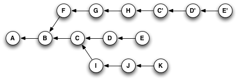
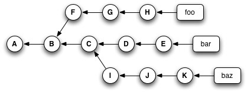

# Git Notes

## Cheatsheet

```sh
# SSH Key Generation
ssh-keygen -t ed25519 -C bmilcs@yahoo.com

# Git Config Setup
git config --global user.name "Bryan Miller"
git config --global user.email "bmilcs@yahoo.com"
git config --global init.defaultBranch main
git config --global color.ui auto

# Get Remote Repo URL
git remote -v

# Confirm settings
git config --get user.name
git config --get user.email

# Change Default Editor
git config --global core.editor "code --wait"

#Commands related to a remote repository:
git clone git@github.com:USER-NAME/REPOSITORY-NAME.git
git push or git push origin main (Both accomplish the same goal in this context)

# Commands related to the workflow:
git add .
git commit -m "A message describing what you have done to make this snapshot different"

# Remove file from staging area
git reset -- path/to/file

# Clear all changes & reset to last commit (destructive)
git reset --hard

# Commands related to checking status or log history
git status
git log
```

## Commit Messages

Commits are a **snapshot** of your code at the moment the commit is made.

### Why commit messages are important:

- **Applying for jobs**: Employers look through projects on Github and through your commit history. Good commits as a novice help you stand out.
- Allow you & other developers to **quickly see what changes were made and why**. This is useful if a bug is found that needs to be fixed.
- Helpful if you **come back to a project after a long break**. You won't likely remember your original thought process.
- Maintainability: Important to a project's long term success

### When to Commit

- Every time you have meaningful changes in the code.
- Creates a timeline of progress & that your finished code didn't appear out of nowhere.
- If you get a piece of code to:
  - function like you want to
  - fix a typo
  - or fix a bug

When you finally get something just right, it is the perfect time to commit. 30 seconds to a few days later, it breaks. Everything could appear the same and you don't remember editing that line, but it doesn't work anymore. You'll want to be able to revert to the last commit you made when you got it working or see what it looked like at that time.

## Tips

- Use VSCode spell check extension
- Use an **active voice**: "Fix card generator"
- Avoid vague messages: "saved", "updated"
- Commit _early_ and _often_
- Be concise & consistent
  - Important when using `git log`
  - Adds structure

## How to Write an Individual Commit Message

- A Team has to agree on commit message convention that defines 3 things:
  - **Style.** Markup syntax, wrap margins, grammar, capitalization, punctuation.
  - **Content.** What kind of info should it contain
  - **Metadata.** How issue tracking ID's, pull request numbers, etc. be referenced

## 7 Rules of Great Commits

1. Separate subject from body with **blank line**.

   1. `Fix typo in introduction to user guide`

2. Limit subject line to 50 characters.
3. Capitalize the subject line.
   1. `Fix` vs `fix`
4. Do not end subject line with period.
5. Use imperative mood in subject line.
   1. `Clean your room`, `Close the door`, `Take out the trash`
   2. If applied, this commit will `<insert commit message here>`
6. Wrap body at 72 characters.
7. Use body to explain _what_ and _why_ -- _not how_

## Commit Verbs

- **Add** some feature
- **Remove** class whatever
- **Update** dependency x
- **Refactor** function y
- **Fix** crazy bug

## Best Practices

`Atomic commits` and leveraging those atomic commits to make your commit messages more useful to **future collaborators**.

An atomic commit is a commit that includes _changes related to only one feature or task of your program._ There are two main reasons for doing this:

- first, if something you change turns out to cause some problems, it is easy to revert the specific change without losing other changes
- second, it enables you to write better commit messages.

## Origin/Main

- **Origin**: remote connection's default name
- **Main**: branch

## Glossary

- **Version Control** any system that allows you to understand the history of the file and how it has progressed
- **Git**: a version control program which allows you to annotate the changes you make to create an easily traversable system history
- **Commit**: an annotated “snapshot” of the differences made to the system at a given point in time
- **Local**: refers to the computer you’re working on this very minute
- **Remote**: refers to an online location
- **Repository (repo)**: a special folder configured with Git superpowers containing all the files pertaining to your project/system
- **Github**: takes your local commit history and hosts it remotely so that you can access it from any computer
- **Pushing**: the action of taking local Git commits (and whatever work these encompass) and putting them online on Github
- **Pulling**: the action of taking online Github commits and bringing them into your local machine
- **Master (branch)**: the “trunk” of the commit history “tree”; contains all approved content/code
- **Feature branch**: an isolated location, based off of master, where you can write a new piece of work safely before reincorporating said changes back to master
- **Pull Request**: a Github tool that allows users to easily see the changes (the difference or “diff”) that a feature branch is proposing as well as discuss any tweaks that said branch might require before it is merged into master
- **Merging**: the action of taking the commits from a feature branch and adding them to the top of master’s history
- **Checking out**: the action of moving from one branch to another

## Branching

Branching allows you to make changes without having to _worry about breaking_ what you have now.

Branches allow you to hold multiple _alternate reality_ versions of your files at the same time.

`main` was set as the default branch using `git config --global init.defaultBranch main`

Branches on a tree stem off the _trunk_ (`main` branch), or off _other branches_.

Changes made to branches only exist on that branch, leaving other branches alone.

- `main` becomes the place for finished features that are working properly.
- _feature branches_ are used for adding new features to your project in a dedicated branch

### Using Branches

Creating branches:

```sh
git branch <branch_name>
```

Swapping to a branch:

```sh
git checkout <branch_name>
```

Create AND Swap to a new branch:

```sh
git checkout -b <branch_name>
```

List all branches

```sh
git branch
```

Adding a feature branch to your `main` branch using `merge`.

```sh
# While inside your main branch:
git merge <feature_branch>
```

Deleting a branch once it's no longer needed:

```sh
git branch -d <branch_name> # branch has already been merged w/ main
git branch -D <branch_name> # branch HAS NOT been merged w/ main
```

**Best practice**: Delete branches once you're done with them to prevent them from piling up.

**Sharing Code** is another use case for branches.

- Sometimes you may not want to commit to your main or feature branch at all.
- IE: Bugs in a new feature that you can't figure out

Example:

1. Create a new branch called `temp` using `git checkout -b temp`
2. Commit current state of your code to `temp`
3. Push `temp` to your GitHub repo: `git push origin temp`
4. Now others can view your `temp` branch on GitHub using the dropdown

## Changing History

### Changing Last Commit

To add something to the last commit, use `git commit --amend`.

Only `amend` commits that have **NOT BEEN PUSHED** anywhere!

- `amend` does NOT simply edit the last commit
- it **replaces that commit with an entirely new one**
- could potentially destroy commit other devs are working on

When rewriting history always make sure that you do so in a safe manner and that **coworkers are aware of what you're doing**.

```sh
git add file
git commit --amend
```

### Changing Multiple Commits

In order to change commits further back in history, we use the `rebase` command.

`rebase -i` allows us to:

- interactively stop after each commit we're trying to modify
- make whatever changes we wish

To edit the last two commits:

```sh
git rebase -i HEAD~2
```

An interactive window pops up allowing us to edit commits. In order to edit a commit, change `pick` to `edit`, write & exit the file.

To change the commit message, run `git commit --amend`, make the changes and then `rebase --continue`.

In a shared repo, make sure you rebase for a **very good reason** that your **coworkers are aware of.**

### Squashing Commits

Using `squash` helps keep our Git history tidy.

- Squash process may be the standard on some dev teams
- Makes it easier to understand the history of your project

When a feature is merged, we end up with some visually complex logs of all changes a feature branch had on a main branch.

- Important during development
- Aren't necessary while looking through entire history of your main branch

To squash the 2nd commit INTO the 1st: `Create first file`:

```sh
# rebase back to root commit
git rebase -i --root

# pick first commit, squash 2nd
pick e30ff48 Create first file
squash 92aa6f3 Create second file
pick 05e5413 Create third file and create fourth file

# delete two commit messages & enter a new one:
Create first and second file

# write & exit file
```

### Splitting Up A Commit

To split a previous commit up into individual commits:

```sh
# open up interactive rebase
git rebase -i

# change pick to edit for the commit
edit ... commit to be changed

# reset HEAD^ (resets commit to one right before HEAD)
git reset HEAD^

# add changes individually
git add test3.md && git commit -m 'Create third file'
git add test4.md && git commit -m 'Create fourth file'
```

When we run `git reset HEAD^`, we:

- Reset current branch, pointing HEAD at the commit _right before it_
- Also, updated the index (staging area) with the contents of wherever HEAD is now pointed

If you want to move to **where HEAD points to** but _don't_ want to touch the staging area, run `git reset --soft`.

- `soft` only moves HEAD to point elsewhere
- Doesn't touch the index / staging area

`git reset --hard` does the following:

- all steps of `git reset`
  - moves HEAD
  - updates index
- **Also updates the working directory**

`hard` resets can be dangerous as it can potentially destroy data.

Hard resets overwrites the files in the working directory:

- makes it look exactly like the staging area where HEAD points to
- like `git commit --amend`, `hard` resets are a destructive command that overwrites history

**Make sure you know exactly why you're using it & your coworkers are also aware of how and why you're using it.**

## Working With Remotes

### Git Push Force

Normally, Git will only let you push changes IF you've updated your local branch w/ the latest commits from a remote repo.

If you don't update your local branch before a commit, you create a **conflict** on the remote repo & get an error message

- **Great Thing**: Prevents overwriting commits created by others, which could be disastrous
- Error = your history is outdated

`git commit --force` overwrites the remote repo with your own local history.

- **Very dangerous command!**
- Should be used with caution when collaborating with others

Alternatively, you can fix your outdated history error by:

- `fetch` update local history
- `merge`
- `push` again

After pushing a mistake to a remote repo, we will want to undo this commit. It's tempting to just force the push, but again, this is **very dangerous**.

If we can, use a safer command instead: `git revert`

```sh
git revert HEAD
git push origin main
```

Common use cases for `git push --force`:

- Updating pull requests
- When sensitive info is accentally uploaded to a repo
  - Remove all occurences of it

A command that some companies use by default is `git push --force-with-lease`.

- `force-with-lease` is a fail safe
- Checks if the branch you're pushing to has been updated
- Sends you an error if it has
- Gives you an opportunity to `fetch` the work & update your local repo

### Dangers & Best Practices

Dangerous commands when working with others:

- `amend`
- `rebase`
- `reset`
- `push --force`

They can **destroy others work**. When attempting to rewrite history, always check the _dangers of a particular command_ before using & folow these best practices:

1. If working on a team, make sure rewriting history is safe to do & let others know you're doing it.
2. Ideally, stick to using these commands on branches that you're working with by yourself.
3. Using the `-f` flag to force something **should scare you**. You should have a **really good reason for using it**.
4. **Don't push after every single commit.** Changing published history should be avoided when possible.
5. `git amend`: never amend commits that have been pushed to remote repos
6. `git rebase`: never rebase a repo that others may work off of
7. `git reset`: never reset commits that have been pushed to remote repos
8. `git push --force`: only use when appropriate. Use it with caution & preferably default to using `git push --force-with-lease`

## Branches Are Pointers

Branches hold multiple _alternate reality_ versions of our files.

Commits are described as snapshots. Every time you type in `git commit`, your computer is taking a picture of the file contents that have been staged with `git add`.

In other words, **your entire workspace gets copied.**

**Branches** are actually a **pointer to a single commit**!

"_If a branch is just a finger pointing to a single commit, how does that commit know about all the commits that came before it?_"

- Each **commit** is **also a pointer that points to the commit that came before it!**

**HEAD**:

- Special pointer, keeps track of the branch you're currently on
- Points to our most recent commit in the current branch

`git rebase -i HEAD~2`: starts with HEAD pointer & follows subsequence pointers to find which two commits to edit.

**SUMMARY**:

- **Branch**: pointer to a single commit
- **Commit**: snapshot & a pointer to the previous commit in history

## [Merge Conflicts](https://docs.github.com/en/pull-requests/collaborating-with-pull-requests/addressing-merge-conflicts/about-merge-conflicts)

Merge conflicts happen when...

- You merge branches that have competing commits
- Git needs help to decide which changes to incorporate in the final merge

Git can often resolve differences between branches and _merge them automatically_.

- Usually, changes are on different lines or files
- Makes merging simple for computers to understand

### Resolving Merge Conflicts on GitHub

In the GitHub repo, click on:

- `Pull Requests`
- In the Pull Requests list, click on the conflict
- `Resolve Conflicts`
- Delete the conflict markers `<<<<` `>>>>` `====`
  - Incorporate the changes you want to keep
- Click `Commit Merge`
- If prompted, review the branch you're committing to
  - Choose to create a new branch
- `Merge pull request`

### Resolving Merge Conflicts via CLI / Command Line

```sh
cd REPO_PATH

# edit conflicted files in your IDE

git add .
git commit -m "Resolve merge conflict by incorporating both suggestions"
```

### Removed file merge conflicts

To resolve a merge conflict caused by competing changes to a file (ie: person A deletes a file, person B edits the same file):

```sh
cd REPO_PATH
git status

# open file with merge conflicts in your editor
# decide if you want to keep or remove the file

# to add it back
git add README.md

# to remove it
git rm README.md

git commit -m "Resolved conflict by keeping README"
```

## [Think Like (a) Git](https://think-like-a-git.net/)

"... git commands are named _graph manipulation_ commands, creating & deleting nodes, moving pointers around"

### _Graph Theory_: a graph is a collection of:

- nodes
- a collection of edges that connect pairs of nodes

Example: **Maps**

- **Places to go**
- **Ways to get there**


> Question: Is it possible to walk through the city and **cross every bridge once.**

**NOPE: No such route could exist** = Graph Theory (Leonhard Euler)


Euler threw away all the unnecessary information.

- **Node**: Land Mass - _Places to Go_
- **Edges**: Bridge between two nodes - _Ways to get there_

Attaching labels to nodes:

- How programmers/computer scientists use them to compute some kind of meaningful results

Attaching labels to edges:

- **Names**: 12th avenue
- **Numbers**: Weights, distances, or speeds
- **Types**: Relationships, 'friend', 'coworker', 'parent of'
- **Direction**: Bidirectional (friends), Parent (one way)

### **Directed vs Undirected Graphs**


> Directed Graph


> Undirected Graph

Directed & undirected graphs simply means:

- **Is a graph bidirectional or not?**
- **One way or two way street?**

### Reachability


^ Graph:

- **set of three parallel universes**
- time flows from left to right
  **A**: beginning of recorded history
  **B**: _follows_ A

From **E**, the history you see is **E > D > C > B > A**

From **H**, the history you see is **H > G > F > B > A**

From **K**, the history you see is **K > J > I > C > B > A**

Important concept:

- **some parts of the graph are unreachable to you**.
- **depending on where you start, you can reach parts of the graph you couldn't get to otherwise**

### Graphs & GIT

A Git repo is _one giant graph_.

**Commits** consists of two things (at the surface level):

- **A pointer** to the state of your code at a moment in time
- **0+ Pointers** to parent commits

> Pointer = talking about graphs

A Git commit is a **node in a graph** and each node can point to other nodes that came before them.

### Visualizing Git Repos

Visualizers help you make sense of your branch history:

```sh
# flattened view
git log --oneline --abbrev-commit --all

# graph view
git log --oneline --abbrev-commit --all --graph

# see branch & tag labels: decorate
git log --oneline --abbrev-commit --all --graph --decorate

# add color:
git log --oneline --abbrev-commit --all --graph --decorate --color

# setup a git alias to do the same:
git config --global alias.graph "log --graph --oneline –decorate=short"
```

### References are Pointers to Commits

**References**: local branch, remote branch and tag.

**Local Branch Reference** (single repo)

- a file in `.git/refs/heads/`
- contains a commit id that the reference points to
- 40-bytes in size
- "cheap-branching": super fast

**Remote Branch References** (single repo)

- Repo that's been previously been defined as a remote
- Commands for remote branch references:
  - `fetch`
  - `push`
  - `pull` (_combines `fetch` & `merge`/`rebase`_)

**Tag References**

- Branch references that never move
- Once created, a tag will never change.
  - exception: `--force`
- Uses
  - marking specific versions of a software package
  - marking exactly what got deployed to a production server on a particular date
- Only affected by `tag` command

### Git Visualizers

Visualizers hide commits from you.

### Garbage Collection

`git commit --amend` tack on new changes to a previous commit

Git commit's ID is a `SHA-1 hash`. The hash contains info on:

- Contents of the commit
- IDs of its parent commits

`commit --amend`:

- builds a completely different commit
- points your local branch reference to it instead

After building a different commit with `--amend`, **the original 1st commit is still on disk** AND you **can get back to it.**

- `git log`/visualizers will not show it to you
- Git doesn't think you care about it

Git runs garbage collection on it's own and can be trigged manually w/ `git gc`.

- Git walks through the graph
- Builds a list of every commit & tag it can reach
- It deletes all commits it doesn't visit

### REFERENCES MAKE COMMITS REACHABLE

- **References**: local branch, remote branch, tag
- **Make Commits**: nodes in a graph
- **Reachable**:

### Branches As Savepoints

Git branches are 40-byte files:

- It takes longer for you to type out the command
- Than the computer to do it

Branches are references and references make commits reachable.

**Creating a branch** is a way to **nail down** part of the graph that you might want to come back to later.

`git merge` & `git rebase` will change your existing commit. Commit ID: hash of its contents & its history.

**You can create a temporary branch any time you want to try something you're unsure about.**

In other words:

**Before merging or rebasing, you can create a branch to save your game before you battle the boss.**

### Playing with Git Merge

Two simple recipes that help you play around with merges:

**Scout Pattern**

- if you're unclear what `merge` does
- or it's likely you'll decide to back out of the merge

**Savepoint Pattern**

- pretty sure what you want to do
- leaving yourself an undo button in case things get messy

### Scout Pattern

**Scout Pattern**: Send a scouting party to check out what the terrain is like.

- If they radio back everything's okay, move ahead & join them
- If not, it was a small scouting party and we can tell their families they died with honor

1. Make sure you're on the right branch and that you have a clean working state.
1. Create a new branch (I often name it test_merge) and switch to it.
1. Do the merge.
1. Switch to your visualizer and predict how its view will change when you refresh it.
1. Refresh your visualizer and see whether your prediction was correct.
1. Are you happy with the result?
   1. If YES: Move your real branch forward to where the test_merge branch is.
   2. If NO: Delete the test_merge branch.

```sh
# example
git status
# On branch master
nothing to commit (working directory clean)

git checkout -b test_merge
git status
# on test_merge branch

git merge spiffy_new_feature
# to abort at this point:
git reset --hard

# switch to your visualizer & predict how its view will change when you refresh it

# are you happy with the result?
# yes: move master branch forward to WHERE test_merge branch is
git checkout master
git merge test_merge

# no: drop the test_merge branch
git checkout master
git branch -D test_merge
```

### Savepoint Pattern

1. Make sure you're on the right branch and that you have a clean working state.
1. Create a new branch to use as a savepoint, but don't switch to it.
1. Do the merge.
1. Switch to your visualizer and predict how its view will change when you refresh it.
1. Refresh your visualizer and see whether your prediction was correct.
1. Are you happy with the result?
   1. If YES: Delete the savepoint.
   2. If NO: Reset your branch to the savepoint.

```sh
# make sure you're on the right branch
git status
# On branch master
nothing to commit (working directory clean)

# create a new savepoint branch
git branch savepoint
git status
# on master branch

# do the merge
git merge spiffy_new_feature
# to undo:
git reset --hard

# switch to visualizer & predict how it'll change
# refresh and see results

# are you happy with the result?
# yes: delete the savepoint.
git branch -d savepoint

# no: reset your branch to the savepoint.
git reset --hard savepoint
# cleanup: del savepoint
git branch -d savepoint
```

### Black Belt Merging

Once comfortable with the Savepoint pattern, you'll get tired of creating the extra branch & having to remember to delete it afterward.

_You don't actually need a savepoint branch for merges_.

- Merge commits end up with a _branch label pointing at them_.
- One of the branch's parent commits will be the commit that that the branch label was just moved from

**The commit you started on will always be reachable.**

Git doesn't care what you call your branches. Branches are just 40-nyte files that points to commit's `SHA-1 hash`, which is what git really uses for all of its work.

- Branches: human-friendly name pointing to a part of the graph

At the end of the savepoint pattern, you reset your branch to the savepoint via `git reset --hard savepoint`.

- `git reset -h` final argument is a **`<commit>`**
- `<commit-ish>`: older versions said this, meaning anything that Git can turn into a `SHA-1 hash`

**Anytime a `<commit>` is needed as an argument, you can use:**

- Branch names
- Tags
- Relative references: `HEAD^`, `HEAD^^`, `HEAD~3`
- Partial `SHA1 hashes`: provide just enough of a hash that it'll be unique and git autofills the rest
- `SHA-1 hashes`

In the savepoint pattern, if you want to back out of the merge, you can just as easily:

- `git log` to find the `SHA-1` of the commit
- `git reset --hard 1234asdf`
- Git would behave exactly the same

### Rebase

Warning: **It is generally considered rude to rewrite history in public!**

- Make sure everyone who works on your project is comfortable working with rebase
- Consider changing everyone's default pull strategy to `rebase` instead of `merge`

### Cherry Picking

Cherry picking does the following:

**Given 1+ existing commits, apply the change each one introduces, recording a new commit for each.**

Example:


`git cherry-pick C D E` would result in:



- Diff from B & C => H
- Diff from C & D => C
- Diff from D & E => D

### Using Cherry Picking to Simulate Rebase



```sh
# make sure we're on H
git checkout foo

# create/swap to newbar
git checkout -b newbar

# apply changes from C D E, creating new commits C', D', E'
# and update 'newbar' branch so it points at E
git cherry-pick C D E
```

> Result of the above commands


```sh
# switch to branch bar
git checkout bar

# force move bar branch pointer to point to same place as `newbar` branch
# --hard updates our working directory to match the new location
git reset --hard newbar

# delete the temporary newbar branch
git branch -d newbar
```

> Result of the above commands:


### Rebase Summary

**ALL of the above can be accomplished by using**:

```sh
git rebase foo bar

# In other words,
# IS EQUAL TO DOING:

git checkout foo
git checkout -b newbar
git cherry-pick C D E
git checkout bar
git reset --hard newbar
git branch -d newbar
```

`git rebase` lets you:

- pick up an entire section of a repo
- move them somewhere else

Rebase **rewrites history**.

- "Hey, you know those things that happened over there on that completely different timeline?"
- "I want you to pretend that they happened here instead."

When using `git rebase`, you can tell it the sequence of events you want to create:

`git rebase first_this then_this`

### [Reset demystified](https://git-scm.com/book/en/v2/Git-Tools-Reset-Demystified)

`reset` and `checkout` can be understood by thinking of git as a:

- Manager of **three trees**
  - HEAD
  - Index
  - Working Directory

**HEAD**: snapshot of your last commit on that branch

- pointer: current branch reference
- in turn, it is a pointer to the last commit
- HEAD will be the parent of the next commit

**INDEX**: proposed next commit

- same as the "staging area"
- it's what git looks at when you run `git commit`
- git populates the index with:
  - list of all file contents that were checked out into your working directory
  - what they looked like when they were originally checked out
  - you then replace some of those files w/ new versions & commit converts that into the tree for a new commit

**WORKING DIRECTORY**: working tree

- HEAD/INDEX: store content efficiently but inconveniently in the `.git` folder
- WORKING DIRECTORY unpacks them into actual files
  - Makes it much easier for you to edit them
- Sandbox: lets you try changes before commiting them to your index & then history

**`git reset`** directly manipulates all three files:

1. **Move HEAD**

- Doesn't change HEAD itself
- Moves the branch that HEAD points to

IF HEAD is set to `master` branch (currently on `master`) and you run `git reset <last_commit>`:

- Changes Master to point to <last_commit>
- Essentially undid the last `git commit`
- `--soft` will stop here.
- Resetting back to `HEAD~` moves a branch back to where it was **without changing the index or working directory.**
  - You can then update the index & `git commit` and accomplish exactly what `commit --amend` does.

2. **Update the Index**

- Updates the index with the contents of whatever snapshot now points to
- `--mixed` will stop here.
- Still undid your last `commit` and also **unstaged everything**.
- You rolled back to before you ran all your `git add` and `git commit` commands

3. **Update the Working Directory**

- `--hard` will cause this step to occur
- Makes the working directory look like the index
- Only version that **CANNOT BE UNDONE**

## Git Workflow (Odin Project App)

**`origin`**: forked repo
**`upstream`**: original repo

**Setup**

1. Fork the original **"upstream"** repo into your own GitHub account.
2. Clone the **forked repo** on your local machine.
   - Cloning gives you a **remote** that points to **origin** (fork on GitHub)
3. Add the original official repo (`upstream`), so we can pull from it.
   - `git remote add upstream git@github.com:theOdinProject/theodinproject.git`

**Making Changes**

1. Create a new feature branch & commit changes
2. Make sure your main branch is up to date
   - `git fetch upstream`
3. Merge upstream's changes into your local version of `main`
   - `git checkout main`
   - `git merge upstream/main`

Note: `fetch pull upstream/branch` is the exact same as doing `fetch upstream/branch` & `merge upstream/branch`

4. With `main` branch up-to-date, merge `main` INTO your feature branch.
   - Feature branch is **dirty**
   - It may contain conflicts
   - `git checkout feature_branch`
   - `git merge main`
5. Resolve any conflicts

**Sending Your Pull Request**

1. Send your feature branch back up to your forked repo:
   - `git push origin feature_branch`
2. Submit a pull request to merge your feature branch into the original `upstream` repo's `main` branch via the GitHub interface.

## [Oh Sh\*t, Git?!?](https://ohshitgit.com/#change-last-commit)

Magic time machine: something went terribly wrong and I need to undo some changes.

```sh
# list everything you've done in git
# across all branches
git reflog

# find the commit before you broke everything
# magic time machine:
git reset HEAD@{index}
```

I committed & I need to make one small change:

```sh
# make your change
git add .
# add change to your last commit
git commit --amend --no-edit
```

Change your last commit message:

```sh
git commit --amend
```

I accidentally committed to master BUT should've been on a new branch:

```sh
# create a new branch from current master
git branch new_branch
# remove the last commit
git reset HEAD~ --hard
# commit now lives here:
git checkout new_branch
```

I accidentally comitted to the wrong branch:

```sh
# undo the last commit (leaving changes available)
git reset HEAD~ --soft
git stash
# move to the correct branch
git checkout correct_branch
git stash pop
git add .
git commit -m "moved to the right branch!"

#
# OR
#

git checkout correct_branch
# grab last commit to master
git cherry-pick master
# delete it from master
git checkout master
git reset HEAD~ --hard
```

I need to undo a commit from 5 commits ago:

```sh
# find the commit to undo
git log

# undo the commit:
git revert commit

# git will create a new commit that undoes the commit
```

I need to undo my changes to a file:

```sh
# find the commit to undo
git log
# save the commit
git checkout commit -- path/to/file
# old version will be in your index
git commit -m "Removed the bad commit"
```

Nuke it all:

```sh
# get the latest state of origin
git fetch origin
git checkout master
# delete untracked files/dirs
git reset --hard origin/master
# repeat checkout/reset/clean for each bad branch
git clean -d --force
```

## [Undo Basically Anything In Git](https://github.blog/2015-06-08-how-to-undo-almost-anything-with-git/)

## [Git Fix Um / Fix Up](https://sethrobertson.github.io/GitFixUm/fixup.html)
