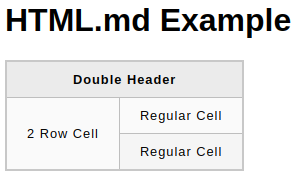

# HTML

**HTML** is a language that determines how documents & web pages are displayed. It is
the building blocks of any web site.

## Tags

**Tags** (`<p>`) are used to create **ELEMENTS** `<p>Element</p>`

It is important to use the correct tags for content, because they:

- Determine web site ranking in search engines.
- Affect accessibility to users who rely on assistive technologies, such as screen readers

## HTML Boilerplate

All HTML documents have the same basic structure or _boilerplate_.

```html
<!DOCTYPE html>
<html lang="en">
  <head>
    <meta charset="UTF-8" />
    <title>My First Webpage</title>
  </head>

  <body>
    <h1>Hello World!</h1>
  </body>
</html>
```

**DOCTYPE declaration** (`<!DOCTYPE>`) tells browser what version of HTML to render document in and the default is HTML5.

```html
<!DOCTYPE html>
```

**HTML element** (`<html>`) is the root element of the document. It becomes important when _adding Javascript._

**Language attribute** (`lang`) of the html element improves accessibility.

```html
<!DOCTYPE html>
<html lang="en"></html>
```

**HEAD element** (`<head>`) contains important meta-information about webpages.

> It should _NOT contain elements that display things on a web page_.

**CHARSET META element** (`<meta charset="" />`) goes inside the `<head>` element and it sets the charset encoding. This ensures that the web page will display symbols & characters of different languages.

- _Unicode Transformation Format 8-bit_ or `UTF-8` is the most popular HTML character encoding since 2008.
- `Unicode` is the industry standard used for _consistency of character encoding_
- More than 90% of all websites use `UTF-8`
- Supports many languages, is compatible with ASCII, and is natively used by XML
- Uses less space than other Unicode encodings

```html
<head>
  <meta charset="UTF-8" />
  ...
</head>
```

**TITLE element** (`<title>`) is also placed in the `<head>` element and it should always contain a **human-readable title**. This title displays in **web browser tab.**

- Defaults to filename of HTML document.

```html
<head>
  ...
  <title>My First Webpage</title>
</head>
```

**BODY element** (`<body>`) is the final element needed to complete boilerplate and it _contains all content that is displayed to users_

- Text, images, lists, etc.

```html
<body>
  <p>Content of page</p>
</body>
```

## Working with Text

**Paragraphs** (`<p>`) create a new line after each paragraph element

```html
<p>My first paragraph</p>
```

**Headings** (`<h1>`) are displayed in bold, larger font.

- They range from `<h1>` through `<h6>`
- Using correct level of heading is important to provide hierarchy to content
- `<h1>` for heading of overall page
- Lower level headings for content of smaller sections of page

```html
<h1>Biggest</h1>
...
<h6>Smallest</h6>
```

**Strong Element** (`<strong>`) makes text **bold**.

- Semantically marks text as important
- Affects screen readers
- Affects tone of voice
- Used in combination with other elements

```html
<p>My name is <strong>Bryan Miller</strong></p>
```

**Em Element** (`<em>`) makes text _italic_.

- Places emphasis on text
- Affects screen readers

```html
<p>My name is <em>Bryan Miller</em></p>
```

## Nesting & Indentation

Elements within other elements are indented, and are known as **nested elements.**

- Creates parent and child relationship
- Siblings: Elements at the same level

## HTML Comments

**HTML Comments** allow us to comment on our code for other developers and our future selves. This is to provide context about something that may be unclear in the code.

- Not visible to the browser

```html
<!-- THIS IS A COMMENT -->
<p>This is not a comment</p>
```

## Lists

[Shay Howe's HTML list tutorial](https://learn.shayhowe.com/html-css/creating-lists/)

## Unordered Lists

Unordered lists are created with the `<ul>` tag, and each item within that list is created with `<li>`

```html
<ul>
  <li>Item 1</li>
  <li>Item 2</li>
  <li>Item 3</li>
</ul>
```

## Ordered Lists

Ordered lists are created with the `<ol>` tag.

```html
<ol>
  <li>Item 1</li>
  <li>Item 2</li>
  <li>Item 3</li>
</ol>
```

## Description Lists

Dictionary-like list used to outline multiple items and their descriptions, such as a glossary. The `<dl>` tag creates the list, the `<dt>` tag creates a term, and the `<dd>` creates the definition.

```html
<dl>
  <dt>word</dt>
  <dd>definition</dd>
</dl>
```

## Attributes

Attributes give additional information to an HTML element.

- Go inside an element's opening tag
- Consists of two parts: name & value

## Links

**Anchor Elements** (`<a>`) create a link in HTML. Without an _attribute_, the `<a>` tag will go nowhere.

- `href` attribute = _hyperlink reference_ (URL)
- `<a>` can link to any resource on the internet, not just other HTML documents (_Videos, PDF files, Images, etc._)

```html
<a href="https://www.bmilcs.com">Click me</a>
```

### Link Types

**Absolute Links** must contain a protocol and a domain.

`protocol://domain/path`

`https://www.bmilcs.com/home`

In the above example, `https` is the protocol and the domain is `bmilcs.com`

### Relative Links

Links to other pages within a website are called `relative links`.

- Doesn't contain the domain
- Relative to the `index` file

`<a href="about.html">About</a>`
`<a href="pages/about.html">About</a>`

`pages/about.html` can cause unexpected issues. Adding `./` before the link will usually prevent them.

`./` starts searching in your `current` directory.

## Images

Images are displayed with the `` tag. The `` tag is _empty_, meaning it doesn't have a _closing tag_.

- Embedding an image requires the `src` attribute.

``

The four main image formats on the web are:

- **JPG**
  - Handle large color pallettes without huge file sizes
  - Used for photos/images with lots of gradients
  - NO transparency
- **GIF**
  - Simple animations
  - Limited in color palette
  - Transparency is binary: Full or Opaque, no semi-opaque pixels
- **PNG**
  - Great for non-animated, non-photo
  - Larger than equivalent JPG for photos
  - Opacity is not an issue
  - Don't have color palette limitations
  - Best use: icons, technical diagrams, logos, etc.
- **SVG**
  - Vector-based graphics format
  - Scale up/down to any dimension without loss of quality
  - Great for responsive designs
  - Same use as PNG, should be used whenever you can.
  - Issue: for them to display consistently across browsers, you have to convert text fields to outlines using an image editor.
    - If image contains a lot of text, file size will be big

## Alt Attribute

Every image should contain the `alt` (alternative text) attribute.

- Used to describe an image
- Used in place of the image **if it can't be loaded**
- Used with screen readers to describe image for the visually impaired

``

## Parent Directories

To reference paths one level out of the current directory, you need to use `../`.

If you want to reference `/images/dog.jpg` from `/pages/about.html`:

``

## Link Targets

Define where to display a page when user clicks a link.

- Default: Replace current page w/ new one
- `target="_blank"` specifies a new tab

## Naming Conventions

Best practices:

- All lower case
- Hyphens `-` instead of spaces

# DIV

DIV is one of the most basic HTML elements.

- Empty container for other elements

```html
<div>Welcome to the machine.</div>
```

# Classes

- Attributes that you place in an HTML element
- Case sensitive
- Multiple classes can be added to a single element
- Classes can be reused on as many elements as you want
  - Whitespace is used to separate multiple classes

```html
<div class="alert-text pink-floyd">Welcome to the machine.</div>
```

# [Emmet (Visual Studio Code)](https://docs.emmet.io/abbreviations/syntax/)

- [Emmet Cheat Sheet](https://docs.emmet.io/cheat-sheet/)

Creating elements

```html
<!-- create button with id "btnId" and classes "class1" "class2" -->
button.class1.class2#btnID
<!-- hit tab and it becomes: -->
<button class="class1 class2" id="btnID"></button>
```

Children `>`

```html
div>ul>li
<!-- tab -->
<div>
  <ul>
    <li></li>
  </ul>
</div>
```

Sibling `+`

```html
div+p+bq
<div></div>
<p></p>
<blockquote></blockquote>
```

Climb-up `^`

```html
div+div>p>spam+em
<div></div>
<div>
  <p><span></span><em></em></p>
</div>

div+div>p>span+em^bq (blockquote rises above current sibling)
<div></div>
<div>
  <p><span></span><em></em></p>
  <blockquote></blockquote>
</div>

div+div>p>span+em^^^bq (bq rises above multiple parents)
<div></div>
<div>
  <p><span></span><em></em></p>
</div>
<blockquote></blockquote>
```

Multiplication `*`

```html
ul>li*5
<ul>
  <li></li>
  <li></li>
  <li></li>
  <li></li>
  <li></li>
</ul>
```

Grouping `()`

```html
div>(header>ul>li*2>a)+footer>p
<div>
  <header>
    <ul>
      <li><a href=""></a></li>
      <li><a href=""></a></li>
    </ul>
  </header>
  <footer>
    <p></p>
  </footer>
</div>

(div>dl>(dt+dd)*3)+footer>p
<div>
  <dl>
    <dt></dt>
    <dd></dd>
    <dt></dt>
    <dd></dd>
    <dt></dt>
    <dd></dd>
  </dl>
</div>
<footer>
  <p></p>
</footer>
```

ID `#` & Class `.`

```html
div#header+div.page+div#footer.class1.class2.class3
<div id="header"></div>
<div class="page"></div>
<div id="footer" class="class1 class2 class3"></div>
```

Custom Attributes

```html
td[title="Hello world!" colspan=3]
<td title="Hello world!" colspan="3"></td>
```

Item Numbering `$`

```html
ul>li.item$*5
<ul>
  <li class="item1"></li>
  <li class="item2"></li>
  <li class="item3"></li>
  <li class="item4"></li>
  <li class="item5"></li>
</ul>

<!-- number padding -->
ul>li.item$$$*5
<ul>
  <li class="item001"></li>
  <li class="item002"></li>
  <li class="item003"></li>
  <li class="item004"></li>
  <li class="item005"></li>
</ul>
```

Changing Numbering Base & Direction

```html
<!-- Change direction 5-1 -->
ul>li.item$@-*5
<ul>
  <li class="item5"></li>
  <li class="item4"></li>
  <li class="item3"></li>
  <li class="item2"></li>
  <li class="item1"></li>
</ul>

<!-- Change counter base value -->
ul>li.item$@3*5
<ul>
  <li class="item3"></li>
  <li class="item4"></li>
  <li class="item5"></li>
  <li class="item6"></li>
  <li class="item7"></li>
</ul>
```

Text `{}`

```html
a{click meeee}
<a href="">click meeee</a>

p>{Click }+a{here}+{ to continue}
<p>Click <a href="">here</a> to continue</p>

p{Click }+a{here}+{ to continue}
<p>Click</p>
<a href="">here</a> to continue
```

# SVGs

`SVG` = Scalable Vector Graphic

SVGs are a very common image format on the web. They're an incredibly powerful tool for creating **high-quality**, **dynamic** images.

SVGs are a _scalable_ image format, which means they retain quality without increasing file size. They're very useful because you can **change their properties through CSS & JavaScript.**

Common uses:

- Icons
- Graphs/Charts
- Large, simple images
- Patterned backgrounds
- Applying effects to other elements (_via SVG filters_)

Vector graphics are images defined _by math_. Conversely, raster graphics are defined by a _grid of pixels._ Raster graphics are limited to the size of the pixel grid and if you increase their size, you also increase the file size.

SVGs are defined used `XML`. Extensible Markup Language is an HTML-like syntax used for APIs, RSS, spreadsheet & word editing software, etc.

**Benefits of XML/SVG:**

- Human readable
- Designed to be interoperable with html
  - It can be placed directly in an HTML file without any changes

**Drawbacks**

- Great for simple graphics, but they are extremely inefficient at storing complex images
- Photo-realistic, fine details or texture are a poor choice for SVG

## Anatomy of an SVG

You will **not** want to create SVGs from scratch. Adobe Illustrator or Figma are popular choices for creating SVGs.

It's common to download SVGs and tweak/adjust them.

```html
<svg xmlns="http://www.w3.org/2000/svg" viewBox="0 0 100 100">
  <rect x="0" y="0" width="100" height="100" fill="burlywood" />
  <path
    d="M 10 10 H 90 V 90 L 10 60"
    fill="transparent"
    stroke="black"
    stroke-width="3"
  />
  <circle cx="50" cy="50" r="20" class="svg-circle" />
  <g class="svg-text-group">
    <text x="20" y="25" rotate="10" id="hello-text">Hello!</text>
    <use href="#hello-text" x="-10" y="65" fill="white" />
  </g>
</svg>
```

- `xlmns` XML NameSpace: what dialect of XML you're using.
- `viewbox`: Defines bounds of your SVG - positions of different points of the element in your SVG, aspect ratio and origin of the SVG
- ` class``id `: Same as HTML, allowing you to target an element w/ JavaScript/CSS
- `<circle>`, `<rect>`, `<path>`, `<text>` are the building blocks of SVGs.
- `fill`, `stroke` are attributes that can be changed via CSS

## Embedding SVGs

Linking SVGs is similar to linking other images. _However_, the contents of the SVG will **not** be available from the webpage.

Inline SVGs (pasting contents directly into your code) will render correctly and allow you to access SVG properties via JavaScript or CSS.

Drawbacks of inline SVGs:

- Makes your code harder to read
- Makes your page less cacheable
- Large SVGs can delay HTML loading times

If don't need to weak the SVG code w/ JS/CSS, externally link SVGs because its cleaner and simpler.

# Tables

Tables are created with the `<table>` tag.

Table cells are created with the `<td>` tag.

Rows are created with `<tr>` tag.

Headers are created with the `<th>` tag.

**Allowing cells to span across multiple rows/columns**

```html
<table>
  <tr>
    <th colspan="2">Double Header</th>
  </tr>
  <tr>
    <td rowspan="2">2 Row Cell</td>
    <td>Regular Cell</td>
  </tr>
  <tr>
    <td>Regular Cell</td>
  </tr>
</table>
```



## **Advanced Table Features & Accessibility**

### Captions

**Captions** contain a description of the table contents. It is particularly useful for **blind people** by helping them decide if they want to hear all of the table data.

Captions are added via the `<caption>` tag. It should be placed just below the opening `<table>` tag.

### Table Structure: <thead>, <tfoot>, <tbody>

`<thead>`, `<tfoot>` and `<tbody>` do **NOT** add accessibility OR visual enhancements on their own.

They are useful for _styling and layout_.

`<thead>` is the table header and should be placed at the top of your table, under any `<col>/<colgroup>` elements.

`<tfoot>` is the table footer and it's useful for the summing of rows. It will automatically render at the bottom of the table, regardless of where it's placed.

`<tbody>` is a wrapper for the other parts of a table.

### Nesting Tables

Tables can be nested within each other: a table within the cell of another table.

### Tables for the Visually Impaired

Screen readers identify **all headers** and use them to make programmatic associations between those headers and the cells they relate to.

**The `scope` attribute**

`scope` attribute can be added to `<th>` (table headers) to tell screen readers what the header is a header for. IE: Is it a header for a row or column?

`scope` has two more values: `colgroup` and `rowgroup`. These sit over multiple columns or rows.

```html
<thead>
  <tr>
    <th scope="col">Purchase</th>
    <th scope="col">Location</th>
    <th scope="col">Date</th>
    <th scope="col">Evaluation</th>
    <th scope="col">Cost (€)</th>
  </tr>
</thead>

<tr>
  <th scope="row">Haircut</th>
  <td>Hairdresser</td>
  <td>12/09</td>
  <td>Great idea</td>
  <td>30</td>
</tr>
```

**`id` & `headers` Attributes**

`id` and `headers` are alternatives for `scope`. They create associations between headers and cells.

1. Add unique `id` to each `<th>`
2. Add `headers` to each `<td>`.
   1. `headers` should contain a list of `id`'s of all `<th>` elements that act as a header for that cell, separated by spaces.

## Best Practices

[Excellent Resource](https://pencilandpaper.io/articles/ux-pattern-analysis-enterprise-data-tables/)

### Text

1. **Left-align columns** - We read left to right. Don't reinvent the wheel.
2. **Match Heading Alignment to Column**
3. **Never use center alignment**
   1. _Right Alignment_ is key for enhancing readability, mental calculations & comparisons between rows.
4. **Avoid Duplication**: Avoid repeating titles in every cell. Add common words to a header.

### Numbers

1. **Right Align Numeric Columns**
2. **Use Monospace Fonts** (tabular typography)

Exception: 1st column, date with numbers - use **left align**.

**Quantitative Numbers** RIGHT ALIGN

- Amounts, money, quantities
- Measures
- Percentages

**Qualitative Numbers** LEFT ALIGN

- Date
- Zip, Postal Code
- Phone Number

## The Form Element

Forms are one of the most crucial parts of your site. They are your user's gateway into your backend: the user provides data and you do stuff with it. There are many ways to collect a piece of a data, so you need to _specify the proper types of inputs_.

The form element is a **container element**, like div. The form element wraps all the inputs a user will interact with on a form.

The form element accepts two essential attributes:

1. `action` attribute accepts a URL value that tells the form where to send its data to be processed. (ie: hooking into backend systems)
2. `method` attribute tells the browser **which HTTP request method** it should use to submit the form.
   1. `GET`: Retrieve something from a server (ie: Google search)
   2. `POST`: Change something on a server (ie: user creates an account)

```html
<form action="example.com/path" method="post"></form>
```

**Form Controls**

### Input Element

The `input` element is the most versatile of all form control elements. It accepts a `type` attribute, which tells the browser what type of data it should expect and how it should render the input element.

A `text` input accepts any text input (ie: user's first and last names).

```html
<form action="example.com/path" method="post">
  <input type="text" />
</form>
```

### Labels

Labels are used to inform the user what type of data they are expected to enter in an input element.

`<label>` accepts a `for=ID` attribute, which associates it with a particular `<input>` through it's `id` attribute.

When an associated label is clicked, it will focus on the corresponding input so the user can input some data. This makes forms more accessible to users.

```html
<form action="example.com/path" method="post">
  <label for="first_name">First Name:</label>
  <input type="text" id="first_name" />
</form>
```

### Placeholder Attribute

To guide users on what to enter in form elements, we include `placeholder` text in input fields.

Placeholder text should demonstrate _how text should be entered and formatted._

```html
<label for="first_name">First Name:</label>
<input type="text" id="first_name" placeholder="Bob..." />
```

### Name Attribute

Labels tell the user what they should enter into an input field.

```html
<label for="first_name">First Name:</label>
<input type="text" id="first_name" name="first_name" />
```

The `name` attribute lets the backend know what each piece of data represents.

The `name` attribute is a variable name for the supplied input after it is submitted.

Form input should **always** have a `name` attribute, **or it will be ignored when the form is submitted**.

Using [httpbin](https://httpbin.org/), you can see the output when submitting a form.

```html
<form action="http://httpbin.org/post" method="post"></form>
```

### Using Form Controls OUTSIDE of Forms

You can use any form control **outside** of the `<form>` element, even when you don't have a backend server to send the data.

ie: Using JavaScript to take input data and display it somewhere on the page.

### Type Attribute

`Email inputs` are specialized text inputs just for email addresses.

- On mobile devices, they display a different keyboard showing the `@` symbol to make it easier to type.
- Validate that the user has entered a correctly formatted email address

To create an email input, we add a `type="email"` to our input element:

```html
<label for="user_email">Email Address:</label>
<input
  type="email"
  id="user_email"
  name="email"
  placeholder="you@example.com"
/>
```

`Password inputs` are another specialized text input. They mask the inputted data with asterisks `*`.

To create password inputs, we add a `type="password"` to our input element:

```html
<label for="user_password">Password:</label>
<input type="password" id="user_password" name="password" />
```

`Number inputs` only accept numbers and ignore any other characters.

To create number inputs, we add a `type="number"` to our input element:

```html
<label for="amount">Amount:</label>
<input type="number" id="amount" name="amount" />
```

`Date inputs` allow us to collect dates from a user, by rendering a simple date picker calendar.

To create date inputs, we add a `type="date"` to our input element:

```html
<label for="dob">Date of Birth:</label>
<input type="date" id="dob" name="dob" />
```

`Hidden inputs` are hidden from the user, but allow you to send extra data to the backend, such as a timestamp. ie: `type="hidden"`

`Search inputs` are text fields with an "X" icon in them, allowing the user to clear its contents. ie: `type="search"`

- Search values can be automatically saved & reused for autocompletion purposes, across multiple pages on the same site.

`Phone inputs` are text fields that present a special keyboard on mobile for entering phone numbers. No data validation is provided by default. ie: `type="tel"`.

### Global Input Attributes

- `autofocus` boolean: what input is automatically focused when the page loads
- `disabled` boolean: user cannot interact w/ an input element
- `form` attribute: must match the `id` of a `<form>` on the page. This allows you attach input elements that aren't nested in a `<form>` element.
- `name`\*\*\* value sent to the backend, required
- `value` element's initial value

### Other Text Attributes

- `<readonly>` blocks user input, but its value is sent to backend
- `<disabled>` blocks user input, and is NOT sent to backend
- `<size>` sets the width of input
- `<maxlength>` limits # of characters
- `<spellcheck>` if browser supports it

### Built-in Form Validation

- `required` prevents form submission until the field is completed
- `minlength` `maxlength` restrict character counts
- `min` `max` restrict number values
- `type` restricts data to value type: email, number, etc.
- `pattern` regular expression pattern that the data needs to follow

When an element is **valid**:

- Element matches `:valid` CSS pseudo-class
- User will be able to submit the data

When an element is **invalid**:

- Element matches `:invalid` CSS pseudo-class
  - Or `:out-of-range` if applicable
- User will be blocked if they submit the data

```html
<form>
  <label for="choose">Would you prefer a banana or a cherry?</label>
  <input id="choose" name="i-like" required pattern="[Bb]anana|[Cc]herry" />
  <button>Submit</button>
</form>
```

### Text Area

`<textarea>` is technically not an input element, but it allows the user to enter **multi-line** text, such as comments and reviews.

- Can be resized by clicking & dragging the bottom right corner
- Have a closing tag, allowing you to wrap initial content in it
- Accept `rows` and `cols` attributes to control the height/width

To create a text area, we use the `<textarea>` element:

```html
<textarea></textarea>
<textarea>Some initial content</textarea>
<textarea rows="20" cols="60"></textarea>
```

### Selection Elements

Selections allow you to create a predefined list for the user to choose from.

**Selection Dropdowns** render a dropdown list. The `<select>` element is much like an unordered list, where `<option>` elements are the list items.

All `<option>` elements require a `value` attribute, which is what is sent to the backend.

To choose a default option, add the `selected` attribute to it.

You can split options into groups using the `<optgroup>` element, which accepts a `label` attribute.

```html
<select name="fashion">
  <optgroup label="Clothing">
    <option value="t_shirt" selected>T-Shirts</option>
    <option value="sweater">Sweaters</option>
    <option value="coats">Coats</option>
  </optgroup>
  <optgroup label="Foot Wear">
    <option value="sneakers">Sneakers</option>
    <option value="boots">Boots</option>
    <option value="sandals">Sandals</option>
  </optgroup>
</select>
```

### Radio Buttons

When there are 5 or less items to choose from, it's often better to display them on the page instead of hidden behind a dropdown.

Radio buttons allow you to create multiple options that a user can choose. To create a radio button, you add `type="radio"` to an `<input>` element.

To set a default radio button, add the `checked` attribute.

> Only one radio button can be selected at a time.

```html
<h1>Ticket Type</h1>

<div>
  <input type="radio" id="child" name="ticket_type" value="child" checked />
  <label for="child">Child</label>
</div>

<div>
  <input type="radio" id="adult" name="ticket_type" value="adult" />
  <label for="adult">Adult</label>
</div>

<div>
  <input type="radio" id="senior" name="ticket_type" value="senior" />
  <label for="senior">Senior</label>
</div>
```

### Checkboxes

Checkboxes are like radio buttons, but they allow you to choose multiple options at once.

To create a checkbox, add `type="checkbox"` to an `<input>` element. Adding the `checked` attribute makes a checkbox checked by default.

```html
<h1>Pizza Toppings</h1>

<div>
  <input type="checkbox" id="sausage" name="topping" value="sausage" />
  <label for="sausage">Sausage</label>
</div>

<div>
  <input type="checkbox" id="onions" name="topping" value="onions" />
  <label for="onions">Onions</label>
</div>

<div>
  <input type="checkbox" id="pepperoni" name="topping" value="pepperoni" />
  <label for="pepperoni">Pepperoni</label>
</div>

<div>
  <input type="checkbox" id="mushrooms" name="topping" value="mushrooms" />
  <label for="mushrooms">Mushrooms</label>
</div>
```

Single checkboxes are useful if you want a user to toggle something as true or false. Signing up for a newsletter when creating an account is one example:

```html
<div>
  <input type="checkbox" id="newsletter" name="news_letter" checked />
  <label for="newsletter">Send me the news letter</label>
</div>
```

**Note:** Only `checked` elements are sent when submitting a form. Unchecked elemnts do not.

### Buttons

Buttons are used to submit forms and trigger actions.

Buttons accept a `type` attribute, and there are 3 types of buttons.

#### Submit Buttons

One a user is finished filling a form, they need a way to submit it. **The `type` attribute's default value is `type="submit"`**.

To create a submit button, add `type="submit"` to a `<button>` element.

```html
<button type="submit">Submit</button>
```

#### Reset Button

Reset buttons clears all data that the user has entered into a form, and sets all inputs to their initial value.

To create a reset button, add `type="reset"` to a `<button>` element.

```html
<button type="reset">Reset</button>
```

#### Generic Buttons

Generic buttons can be used for **anything**. They're commonly used with JavaScript for creating interactive UI's.

To create a generic button, add `type="button"` to a `<button>` element.

```html
<button type="button">Click to do fun stuff</button>
```

**IMPORTANT**: Buttons within a form with `type="submit"` (default value) will _always try to make a new request and submit data to the server._ Therefore, buttons in a form that are used for other purposes should **always** have a specified `type` attribute value to avoid unwanted effects of submitting a form.

#### Image Button

Image buttons are rendered like `` elements, but when clicked, the x & y coordinates are submitted instead of its value.

`<input type="image">` contain all `` and `<button>` attributes.

Image buttons are useful for **heatmaps**.

### File Picker

`<input type="file">` allows the user to attach one or more files to a form.

Restricting filetypes is done using the `accept` attribute.

To allow multiple files to be chosen, add the `multiple` attribute.

Examples:

```html
<!-- image files -->
<input type="file" name="file" id="file" accept="image/*" multiple />

<!-- mobile device, direct camera / microphone capture -->
<input type="file" accept="image/*;capture=camera" />
<input type="file" accept="video/*;capture=camcorder" />
<input type="file" accept="audio/*;capture=microphone" />
```

### Slider Controls

Number picking can be done with a slider. Sliders are created with an input element and a `type="range"`. Sliders should contain:

- `min` attribute
- `max` attribute
- `step` attribute: increment value

To display the value of a slider, we use the `<output>` element. Similar to `<label>`, we add the `for` attribute to associate the `<output>` field a the slider.

To actually get it working, we need to use JavaScript:

```js
const price = document.querySelector("#price");
const output = document.querySelector(".price-output");

output.textContent = price.value;

price.addEventListener("input", () => {
  output.textContent = price.value;
});
```

### Autocomplete box

We can provide suggestions or automatically completed values for form widgets using `<datalist>` container with nested `<option>` elements.

To associate the datalist with an input, we add the `list` attribute to the input element and specify the `id` of the datalist.

For color pickers, we can specify a pallette of specific colors in addition to the default color picker.

```html
<label for="myFruit">What's your favorite fruit?</label>
<input type="text" name="myFruit" id="myFruit" list="mySuggestion" />
<datalist id="mySuggestion">
  <option>Apple</option>
  <option>Banana</option>
  <option>Blackberry</option>
  <option>Blueberry</option>
  <option>Lemon</option>
  <option>Lychee</option>
  <option>Peach</option>
  <option>Pear</option>
</datalist>
```

### Progress & Meter bars

Progress bars are created like so:

```html
<progress max="100" value="75">75/100</progress>
```

Meter bars represent a fixed value in a range delimited by `min` and `max` values.

They are colored according to the `optimum` value: green, yellow or red.

### Organizing Form Elements

In large forms, users can easily get overwhelmed and discouraged if there are many inputs to fill in.

There are a couple of elements that make it easy to organize forms into sections that are:

- visually distinct
- manageable to digest

#### Fieldset & Legend Element

The Fieldset element is a container element that allows us to group related inputs together into a logical unit.

The Legend element is a heading or caption within fieldset elements. The `<legend>` element should always come directly after the opening `<fieldset>` tag.

A common use-case for these elements is to **group radio buttons** and use a `<legend>` to communicate what each of the options are ultimately for.

```html
<fieldset>
  <legend>What would you like to drink?</legend>

  <div>
    <input type="radio" name="drink" id="coffee" value="coffee" />
    <label for="coffee">Coffee</label>
  </div>

  <div>
    <input type="radio" name="drink" id="tea" value="tea" />
    <label for="tea">Tea</label>
  </div>

  <div>
    <input type="radio" name="drink" id="soda" value="soda" />
    <label for="soda">Soda</label>
  </div>
</fieldset>

<fieldset>
  <legend>Contact Details</legend>

  <label for="name">Name:</label>
  <input type="text" id="name" name="name" />

  <label for="phone_number">Phone Number:</label>
  <input type="tel" id="phone_number" name="phone_number" />

  <label for="email">Email:</label>
  <input type="email" id="email" name="email" />
</fieldset>

<fieldset>
  <legend>Delivery Details</legend>

  <label for="street_address">Street Address:</label>
  <input type="text" id="street_address" name="street_address" />

  <label for="city">City:</label>
  <input type="text" id="city" name="city" />

  <label for="zip_code">Zip Code:</label>
  <input type="text" id="zip_code" name="zip_code" />
</fieldset>
```

### Styling Forms

Each browser has its own default style for form controls. To have consistency across all browsers, we have to _over default styles_ and _style them ourselves._

Some **form controls** are tricky & downright impossible style. Text-based controls are straightforward, but radio buttons and checkboxes are challenging.

[CSS Guide for Styling Radio Buttons & Checkboxes](https://moderncss.dev/pure-css-custom-checkbox-style/)

```css
/* change color of checkbox/radio button */
accent-color: rebeccapurple;
```

Calendar or date pickers are downright impossible to style, requiring us to build JavaScript custom controls or one of the many JavaScript libraries that provide ready made solutions.

#### Easy To Style

- `<form>`
- `<fieldset>` `<legend>`
- single line `<input>`'s, _except for search_
- `<textarea>`
- `<button>` & `<input type="button">`
- `<label>`
- `<output>`

#### Challenging To Style

- `<input type="checkbox">`
- `<input type="radio">`
- `<input type="search">`

#### Very Difficult To Style

- `<input type="color">`
- `<input type="datetime-local">`
- `<input type="range">`
- dropdown related elements:
  - `<select>`
  - `<option>`
  - `<optgroup>`
  - `<datalist>`
- `<progress>`
- `<meter>`

###
